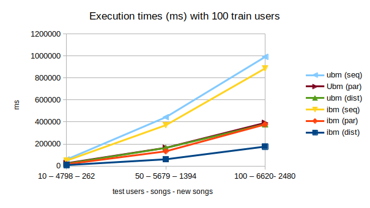
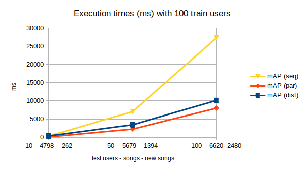

# Music Recommendation
Repository for the project of the Scalable and Cloud Computing course @unibo, a.y. 2022-23.

Inspired by the Million Song Dataset challenge on Kaggle, a comparison of various solutions to the problem
exploiting the MapReduce paradigm and providing an environment for sequential, parallel and distributed
execution. Hence, we aim to provide not only a comparison between the different algorithms, but also an
analysis of the behaviours of these algorithms across the different executions.

The different algorithms produced can be found in the `src/main/scala/` directory as scala worksheet
files. To execute the algorithms, one should download the <b>Echo Nest Taste Profile Subset</b> dataset from
http://millionsongdataset.com/tasteprofile/ and place the `train_triplets.txt` file under the `src/main/resources/`
directory (we advise working on a subset of it; `dataAnalysis.ipynb` can be an useful tool to do that).
Once executed, the results of the training will be available through a text file with the same name of the
algorithm which can be found under `target/scala-2.12/classes/models/`. Make sure to also have an empty file in
`src/main/resources/models/` with the same name of the model (in case not, create it, as it will be used to dynamically
create the path for the output model, which will still be found under the `target/scala-2.12/classes/models/` path).

We plan to implement the following algorithms:
- UserBasedModel
- ItemBasedModel
- LinearCombinationModel
- AggregationModel
- StochasticAggregationModel

## How to execute code on Google Cloud Platform
1. Be sure that:
    * Every file path in code is in the local path (e.g., "train_100_50.txt" instead of "~/MusicReccomender/.../train_100_50.txt")
    * All files are loaded with `Source.fromResource` instead of `Source.fromFile`
    * You have already created a Google Cloud Project ([here's a guide](https://cloud.google.com/dataproc/docs/guides/setup-project))
    * You have already installed Google Cloud CLI ([here's a guide](https://cloud.google.com/sdk/docs/install))
2. Create an assembly *.jar* package using the following command (in the project directory):
   ```sh
   sbt clean assembly
   ```
   * (Optional, but strongly recommended) You can check if the code works: go to `MusicReccomender/target/scala-2.12/` and run
     ```shell
       java -jar package.jar
       ```
3. Create a new bucket inside the project in Google Cloud Platform (in this example it is called `mr`)
4. Copy the package created inside `MusicReccomender/target/scala-2.12/` to the bucket with the following command:
   ```shell
   gsutil cp package.jar gs://mr
   ```
5. Create a Compute Engine Cluster on Google Cloud Platform
    * Be careful to choose the correct linux image, which is *2.1 (Debian 11, Hadoop 3.3, Spark 3.3) first release: 22/01/2021*
    * You can plan the elimination of the cluster so that you won't waste credits 
6. Create and send a new job by:
   1. Selecting the created cluster
   2. Choosing *Spark* job  as "Type of job"
   3. Typing `gs://mr/package.jar` in "Main class or jar" 

## Some notes about some choices made during the project

### getModel alternatives:

- using only map:

```
songs.map(s => if (!testUsersToSongsMap(user).contains(s)) user -> (s, rank(user, s)) else user -> (s, 0.0))
```

- using external map and internal for:

```
songs map (s => {
  for {
    u <- testUsers filter (u => !testUsersToSongsMap(u).contains(s))
  } yield u -> (s, rank(u, s))
})
```

- using only for:

```
for {
  s <- songs
  u <- testUsers
  if !testUsersToSongsMap(u).contains(s)
} yield u -> (s, rank(u, s))
```

The latter has been (sperimentally) proven to be the most efficient for both sequential and parallel computations, while in the distributed version the second works better, as we can distribute only on one RDD (more considerations on this later).

- Parallel version of the third alternative:

```
for {
  s <- songs.iterator.toSeq.par
  u <- testUsers.iterator.toSeq.par
  if !testUsersToSongsMap(u).contains(s)
} yield u -> (s, rank(u, s))
```

In the for construct over both structures, the if statement has been proven to work better than the filter, differently from the other cases (i.e., for over one single structure and map).

- Distributed version of the second alternative:

```
object _BasedModel {

  ...

  def getRanks1(user: String):ParSeq[(String, (String, Double))] = {
    // foreach song, calculate the score for the user
    for {
      song <- songs.iterator.toSeq.par filter (song => !testUsersToSongsMap(user).contains(song))
    } yield {
      user -> (song, rank(user, song))
    }
  }

  def getRanks2(song: String): ParSeq[(String, (String, Double))] = {
    // foreach user, calculate the score for the user
    for {
      user <- testUsers.iterator.toSeq.par filter (user => !testUsersToSongsMap(user).contains(song))
    } yield {
      user -> (song, rank(user, song))
    }
  }
}

...

ctx.parallelize(testUsers).map(user => _BasedModel.getRanks1(user).seq).collect.flatten
ctx.parallelize(songs).map(song => _BasedModel.getRanks2(song).seq).collect.flatten

```

About distribution, we also have to take in account the number of nodes and cores per node that we can use. For
instance, in our case dividing the computation over the songs has proven to be better than dividing over the number of
users in all the experiments, therefore if we had more nodes than cores per node we would distribute over the songs
mapping them over the getRanks2 function; otherwise, if we had more cores per node rather than nodes, we would
distribute over the users mapping them over the getRanks1 function and making use of the greater parallelization
happening inside every single node. The same valuations stand in case for some reason the number of users grows
exponentially while the number of songs stays the same.

## Experiments

The following results are obtained on an Intel® Core™ i5-8250U Processor, 6M Cache, up to 3.40 GHz, 4 cores, 8 threads.
All times are in ms.

Specifically, we only reported times for our computation of interest: user based model (ubm), item based model (ibm) and
the evaluation (mAP), calculated as a mean of the execution times of the evaluation function for each model. Combination
models are not considered, as the execution time of the combination between ubm and ibm has never exceeded one second
and therefore parallelization and distribution would not be useful (keep in mind that to compute the combination models
one should have computed both ubm and ibm beforehand; therefore, all combinations are in fact taking advantage of
distribution, and each computation time for a combination model can be simplified as time_ubm + time_ibm + time_comb,
with time_comb << time_ubm + time_ibm such that time_comb is negligible). 

We designed the sets of experiments: the first two are meant to compare the scalability of the proposed solution and the
efficiency of the models and the evaluation function, while the third one is meant to compare the models to find which
one is the best, following the challenge spirit in which the problem has first been made (Kaggle). 

The first set of experiments is specifically meant to show the scalability of the mAP distribution, as it depends on the
number of NewSongs (which depends on the number of test users), making it difficult to emphasize it in the other
experiments, as we had to stick with 10 test users for computation issues.

The second set of experiments is meant to show the scalability of the application over an increasing number of train
users, which increases the number of considered songs, which are the main character of our distribution solution.

Finally, the third experiment is meant to compare the various models using as evaluation function the mean average
precision to find the best one. This is done only on the distributed version, making use of the proven scalability to
compute the models on a much bigger dataset.

### Incrementing the number of test users

- Sequential:

| TrainUsers | TestUsers | Songs | NewSongs | ubm    | ibm    | mAP (mean) |
|------------|-----------|-------|----------|--------|--------|------------|
| 100        | 10        | 4798  | 262      | 58658  | 48383  | 356        |
| 100        | 50        | 5679  | 1394     | 443302 | 370886 | 7058       |
| 100        | 100       | 6620  | 2480     | 991868 | 887161 | 27347      |

- Parallel:

| TrainUsers | TestUsers | Songs | NewSongs | ubm    | ibm    | mAP (mean) |
|------------|-----------|-------|----------|--------|--------|------------|
| 100        | 10        | 4798  | 262      | 24893  | 15906  | 117        |
| 100        | 50        | 5679  | 1394     | 165072 | 133247 | 2249       |
| 100        | 100       | 6620  | 2480     | 391485 | 377474 | 8003       |

- Distributed (note: take this with a grain of salt, as we are running Spark locally, therefore virtualizing the
distribution)

| TrainUsers | TestUsers | Songs | NewSongs | ubm    | ibm    | mAP (mean) |
|------------|-----------|-------|----------|--------|--------|------------|
| 100        | 10        | 4798  | 262      | 20303  | 8082   | 393        |
| 100        | 50        | 5679  | 1394     | 163840 | 60680  | 3440       |
| 100        | 100       | 6620  | 2480     | 379735 | 176130 | 10123      |




### Incrementing the number of train users

- Sequential:

| TrainUsers | TestUsers | Songs | NewSongs | ubm    | ibm    |
|------------|-----------|-------|----------|--------|--------|
| 100        | 10        | 4798  | 262      | 58658  | 48383  |
| 200        | 10        | 8763  | 180      | 204155 | 128436 |
| 300        | 10        | 11660 | 299      | 499692 | 313148 |

- Parallel:

| TrainUsers | TestUsers | Songs | NewSongs | ubm    | ibm    | 
|------------|-----------|-------|----------|--------|--------|
| 100        | 10        | 4798  | 262      | 24893  | 15906  |
| 200        | 10        | 8763  | 180      | 76490  | 43693  |
| 300        | 10        | 11660 | 299      | 183963 | 120420 |

- Distributed (note: take this with a grain of salt, as we are running Spark locally, therefore virtualizing the
  distribution)

| TrainUsers | TestUsers | Songs | NewSongs | ubm    | ibm    |
|------------|-----------|-------|----------|--------|--------|
| 100        | 10        | 4798  | 262      | 20303  | 8082   |
| 200        | 10        | 8763  | 180      | 65032  | 29017  |
| 300        | 10        | 11660 | 299      | 195862 | 65393  |


<details> 
<summary>Results with 100 train users and 10 test users</summary>

- Songs: 4798
- New songs: 262
- Elapsed time for (Sequential) user-based model:	58658ms (58658986898ns)
- Elapsed time for (Parallel) user-based model:	24893ms (24893316523ns)
- Elapsed time for (Distributed) user-based:	20303ms (20303431284ns)
- Elapsed time for (Sequential) item-based model:	48383ms (48383384237ns)
- Elapsed time for (Parallel) item-based model:	15906ms (15906778693ns)
- Elapsed time for (Distributed) item-based:	8082ms (8082279295ns)
- Elapsed time for (Sequential) linear-combination model:	33ms (33520200ns)
- Elapsed time for (Parallel) linear-combination model:	27ms (27268203ns)
- Elapsed time for (Distributed) linear combination:	290ms (290478902ns)
- Elapsed time for (Sequential) aggregation model:	39ms (39876716ns)
- Elapsed time for (Parallel) aggregation model:	29ms (29731934ns)
- Elapsed time for (Distributed) aggregation model:	339ms (339264968ns)
- Elapsed time for (Sequential) stochastic-combination model:	35ms (35551846ns)
- Elapsed time for (Parallel) stochastic-combination model:	24ms (24309424ns)
- Elapsed time for (Distributed) stochastic combination model:	296ms (296024203ns)
- Elapsed time for (Sequential) user-based model mAP:	383ms (383206254ns)
- Elapsed time for (Parallel) user-based model mAP:	115ms (115394876ns)
- Elapsed time for (Distributed) user-based model mAP:	448ms (448760836ns)
- Elapsed time for (Sequential) item-based model mAP:	462ms (462000005ns)
- Elapsed time for (Parallel) item-based model mAP:	137ms (137445127ns)
- Elapsed time for (Distributed) item-based model mAP:	452ms (452198796ns)
- Elapsed time for (Sequential) linear-combination model mAP:	366ms (366446918ns)
- Elapsed time for (Parallel) linear-combination model mAP:	127ms (127101429ns)
- Elapsed time for (Distributed) linear-combination model mAP:	375ms (375027340ns)
- Elapsed time for (Sequential) aggregation model mAP:	292ms (292943075ns)
- Elapsed time for (Parallel) aggregation model mAP:	109ms (109518704ns)
- Elapsed time for (Distributed) aggregation model mAP:	360ms (360157134ns)
- Elapsed time for (Sequential) stochastic-combination model mAP:	273ms (273454369ns)
- Elapsed time for (Parallel) stochastic-combination model mAP:	99ms (99347299ns)
- Elapsed time for (Distributed) stochastic-combination model mAP:	332ms (332107192ns)
- (Sequential) user-based model mAP: 0.06180479825517996
- (Parallel) user-based model mAP: 0.06180479825517996
- (Distributed) user-based model mAP: 0.06180479825517996
- (Sequential) item-based model mAP: 0.09904580152671755
- (Parallel) item-based model mAP: 0.09904580152671755
- (Distributed) item-based model mAP: 0.09904580152671755
- (Sequential) linear-combination model mAP: 0.1025445292620865
- (Parallel) linear-combination model mAP: 0.1025445292620865
- (Distributed) linear-combination model mAP: 0.1025445292620865
- (Sequential) aggregation model model mAP: 0.06371319520174483
- (Parallel) aggregation model mAP: 0.06371319520174483
- (Distributed) aggregation model model mAP: 0.06371319520174483
- (Sequential) stochastic-combination model mAP: 0.06667575427117413
- (Parallel) stochastic-combination model mAP: 0.08829516539440202
- (Distributed) stochastic-combination model mAP: 0.08416939294801888

</details>

<details> 
<summary>Results with 100 train users and 50 test users</summary>

- Songs: 5679
- New songs: 1394
- Elapsed time for (Sequential) user-based model:	443302ms (443302662242ns)
- Elapsed time for (Parallel) user-based model:	165072ms (165072471133ns)
- Elapsed time for (Distributed) user-based:	163840ms (163840179619ns)
- Elapsed time for (Sequential) item-based model:	370886ms (370886104809ns)
- Elapsed time for (Parallel) item-based model:	133247ms (133247526462ns)
- Elapsed time for (Distributed) item-based:	60680ms (60680446360ns)
- Elapsed time for (Sequential) linear-combination model:	184ms (184318199ns)
- Elapsed time for (Parallel) linear-combination model:	87ms (87586201ns)
- Elapsed time for (Distributed) linear combination:	1661ms (1661453565ns)
- Elapsed time for (Sequential) aggregation model:	94ms (94727328ns)
- Elapsed time for (Parallel) aggregation model:	206ms (206422236ns)
- Elapsed time for (Distributed) aggregation model:	2077ms (2077728369ns)
- Elapsed time for (Sequential) stochastic-combination model:	74ms (74202839ns)
- Elapsed time for (Parallel) stochastic-combination model:	173ms (173552138ns)
- Elapsed time for (Distributed) stochastic combination model:	1535ms (1535567097ns)
- Elapsed time for (Sequential) user-based model mAP:	4250ms (4250434755ns)
- Elapsed time for (Parallel) user-based model mAP:	2087ms (2087645203ns)
- Elapsed time for (Distributed) user-based model mAP:	3315ms (3315580424ns)
- Elapsed time for (Sequential) item-based model mAP:	7922ms (7922687700ns)
- Elapsed time for (Parallel) item-based model mAP:	1601ms (1601470037ns)
- Elapsed time for (Distributed) item-based model mAP:	3360ms (3360055376ns)
- Elapsed time for (Sequential) linear-combination model mAP:	9066ms (9066474651ns)
- Elapsed time for (Parallel) linear-combination model mAP:	2386ms (2386394758ns)
- Elapsed time for (Distributed) linear-combination model mAP:	3447ms (3447589278ns)
- Elapsed time for (Sequential) aggregation model mAP:	9999ms (9999879852ns)
- Elapsed time for (Parallel) aggregation model mAP:	2936ms (2936221676ns)
- Elapsed time for (Distributed) aggregation model mAP:	4055ms (4055350043ns)
- Elapsed time for (Sequential) stochastic-combination model mAP:	7737ms (7737182829ns)
- Elapsed time for (Parallel) stochastic-combination model mAP:	2234ms (2234128152ns)
- Elapsed time for (Distributed) stochastic-combination model mAP:	3021ms (3021076945ns)
- (Sequential) user-based model mAP: 0.03201406830127337
- (Parallel) user-based model mAP: 0.03201406830127337
- (Distributed) user-based model mAP: 0.03201406830127337
- (Sequential) item-based model mAP: 0.07304353273841559
- (Parallel) item-based model mAP: 0.07304353273841559
- (Distributed) item-based model mAP: 0.07304353273841559
- (Sequential) linear-combination model mAP: 0.07322915733221809
- (Parallel) linear-combination model mAP: 0.07322915733221809
- (Distributed) linear-combination model mAP: 0.07322915733221809
- (Sequential) aggregation model model mAP: 0.04614277953880507
- (Parallel) aggregation model mAP: 0.04614277953880507
- (Distributed) aggregation model model mAP: 0.04614277953880507
- (Sequential) stochastic-combination model mAP: 0.05351509988897473
- (Parallel) stochastic-combination model mAP: 0.051781733009349226
- (Distributed) stochastic-combination model mAP: 0.05423599782160435

</details>

<details> 
<summary>Results with 100 train users and 100 test users</summary>

- Songs: 6620
- New songs: 2480
- Elapsed time for (Sequential) user-based model:	991868ms (991868636344ns)
- Elapsed time for (Parallel) user-based model:	391485ms (391485313932ns)
- Elapsed time for (Distributed) user-based:	379735ms (379735402566ns)
- Elapsed time for (Sequential) item-based model:	887161ms (887161514646ns)
- Elapsed time for (Parallel) item-based model:	377474ms (377474236042ns)
- Elapsed time for (Distributed) item-based:	176130ms (176130770260ns)
- Elapsed time for (Sequential) linear-combination model:	374ms (374935773ns)
- Elapsed time for (Parallel) linear-combination model:	164ms (164122590ns)
- Elapsed time for (Distributed) linear combination:	3681ms (3681257329ns)
- Elapsed time for (Sequential) aggregation model:	539ms (539084763ns)
- Elapsed time for (Parallel) aggregation model:	234ms (234358408ns)
- Elapsed time for (Distributed) aggregation model:	4429ms (4429359137ns)
- Elapsed time for (Sequential) stochastic-combination model:	178ms (178715968ns)
- Elapsed time for (Parallel) stochastic-combination model:	395ms (395444889ns)
- Elapsed time for (Distributed) stochastic combination model:	3552ms (3552846833ns)
- Elapsed time for (Sequential) user-based model mAP:	19188ms (19188731520ns)
- Elapsed time for (Parallel) user-based model mAP:	6803ms (6803050050ns)
- Elapsed time for (Distributed) user-based model mAP:	9733ms (9733187920ns)
- Elapsed time for (Sequential) item-based model mAP:	23647ms (23647600538ns)
- Elapsed time for (Parallel) item-based model mAP:	8574ms (8574184133ns)
- Elapsed time for (Distributed) item-based model mAP:	10300ms (10300000722ns)
- Elapsed time for (Sequential) linear-combination model mAP:	30798ms (30798891094ns)
- Elapsed time for (Parallel) linear-combination model mAP:	7884ms (7884662348ns)
- Elapsed time for (Distributed) linear-combination model mAP:	11020ms (11020243833ns)
- Elapsed time for (Sequential) aggregation model mAP:	33962ms (33962035397ns)
- Elapsed time for (Parallel) aggregation model mAP:	9335ms (9335162218ns)
- Elapsed time for (Distributed) aggregation model mAP:	12144ms (12144616411ns)
- Elapsed time for (Sequential) stochastic-combination model mAP:	29140ms (29140917711ns)
- Elapsed time for (Parallel) stochastic-combination model mAP:	7420ms (7420243536ns)
- Elapsed time for (Distributed) stochastic-combination model mAP:	9941ms (9941298168ns)
- (Sequential) user-based model mAP: 0.016535498602550824
- (Parallel) user-based model mAP: 0.016535498602550824
- (Distributed) user-based model mAP: 0.016535498602550824
- (Sequential) item-based model mAP: 0.03945161744725745
- (Parallel) item-based model mAP: 0.03945161744725745
- (Distributed) item-based model mAP: 0.03945161744725745
- (Sequential) linear-combination model mAP: 0.04045516217984957
- (Parallel) linear-combination model mAP: 0.04045516217984957
- (Distributed) linear-combination model mAP: 0.04045516217984957
- (Sequential) aggregation model model mAP: 0.02603719801265665
- (Parallel) aggregation model mAP: 0.02603719801265665
- (Distributed) aggregation model model mAP: 0.02603719801265665
- (Sequential) stochastic-combination model mAP: 0.029517703115932412
- (Parallel) stochastic-combination model mAP: 0.025638645633561417
- (Distributed) stochastic-combination model mAP: 0.025101654661291623

</details>

<details> 
<summary>Results with 200 train users and 10 test users</summary>

- Songs: 8763
- New songs: 180
- Elapsed time for (Sequential) user-based model:	204155ms (204155158480ns)
- Elapsed time for (Parallel) user-based model:	76490ms (76490797927ns)
- Elapsed time for (Distributed) user-based:	65032ms (65032787207ns)
- Elapsed time for (Sequential) item-based model:	128436ms (128436708772ns)
- Elapsed time for (Parallel) item-based model:	43693ms (43693541482ns)
- Elapsed time for (Distributed) item-based:	29017ms (29017904363ns)
- Elapsed time for (Sequential) linear-combination model:	50ms (50372045ns)
- Elapsed time for (Parallel) linear-combination model:	46ms (46787857ns)
- Elapsed time for (Distributed) linear combination:	451ms (451519024ns)
- Elapsed time for (Sequential) aggregation model:	57ms (57997973ns)
- Elapsed time for (Parallel) aggregation model:	35ms (35870119ns)
- Elapsed time for (Distributed) aggregation model:	750ms (750920276ns)
- Elapsed time for (Sequential) stochastic-combination model:	32ms (32620384ns)
- Elapsed time for (Parallel) stochastic-combination model:	39ms (39470361ns)
- Elapsed time for (Distributed) stochastic combination model:	501ms (501646439ns)
- Elapsed time for (Sequential) user-based model mAP:	437ms (437976365ns)
- Elapsed time for (Parallel) user-based model mAP:	158ms (158159590ns)
- Elapsed time for (Distributed) user-based model mAP:	503ms (503051928ns)
- Elapsed time for (Sequential) item-based model mAP:	728ms (728031925ns)
- Elapsed time for (Parallel) item-based model mAP:	228ms (228635286ns)
- Elapsed time for (Distributed) item-based model mAP:	794ms (794649605ns)
- Elapsed time for (Sequential) linear-combination model mAP:	593ms (593021898ns)
- Elapsed time for (Parallel) linear-combination model mAP:	202ms (202417869ns)
- Elapsed time for (Distributed) linear-combination model mAP:	554ms (554476586ns)
- Elapsed time for (Sequential) aggregation model mAP:	427ms (427440330ns)
- Elapsed time for (Parallel) aggregation model mAP:	156ms (156199200ns)
- Elapsed time for (Distributed) aggregation model mAP:	486ms (486076712ns)
- Elapsed time for (Sequential) stochastic-combination model mAP:	436ms (436432375ns)
- Elapsed time for (Parallel) stochastic-combination model mAP:	159ms (159345109ns)
- Elapsed time for (Distributed) stochastic-combination model mAP:	478ms (478264999ns)
- (Sequential) user-based model mAP: 0.06740740740740742
- (Parallel) user-based model mAP: 0.06740740740740742
- (Distributed) user-based model mAP: 0.06740740740740742
- (Sequential) item-based model mAP: 0.11175925925925927
- (Parallel) item-based model mAP: 0.11175925925925927
- (Distributed) item-based model mAP: 0.11175925925925927
- (Sequential) linear-combination model mAP: 0.10851851851851851
- (Parallel) linear-combination model mAP: 0.10851851851851851
- (Distributed) linear-combination model mAP: 0.10851851851851851
- (Sequential) aggregation model model mAP: 0.10666666666666665
- (Parallel) aggregation model mAP: 0.10666666666666665
- (Distributed) aggregation model model mAP: 0.10666666666666665
- (Sequential) stochastic-combination model mAP: 0.08601851851851852
- (Parallel) stochastic-combination model mAP: 0.09388888888888888
- (Distributed) stochastic-combination model mAP: 0.08407407407407406

</details>

<details> 
<summary>Results with 300 train users and 10 test users</summary>

- Songs: 11660
- New songs: 299
- Elapsed time for (Sequential) user-based model:	499692ms (499692797759ns)
- Elapsed time for (Parallel) user-based model:	183963ms (183963880193ns)
- Elapsed time for (Distributed) user-based:	195862ms (195862459192ns)
- Elapsed time for (Sequential) item-based model:	313148ms (313148008407ns)
- Elapsed time for (Parallel) item-based model:	120420ms (120420783665ns)
- Elapsed time for (Distributed) item-based:	65393ms (65393364487ns)
- Elapsed time for (Sequential) linear-combination model:	60ms (60024649ns)
- Elapsed time for (Parallel) linear-combination model:	42ms (42212193ns)
- Elapsed time for (Distributed) linear combination:	666ms (666357856ns)
- Elapsed time for (Sequential) aggregation model:	79ms (79152312ns)
- Elapsed time for (Parallel) aggregation model:	52ms (52591492ns)
- Elapsed time for (Distributed) aggregation model:	811ms (811964429ns)
- Elapsed time for (Sequential) stochastic-combination model:	41ms (41112055ns)
- Elapsed time for (Parallel) stochastic-combination model:	151ms (151327529ns)
- Elapsed time for (Distributed) stochastic combination model:	664ms (664509917ns)
- Elapsed time for (Sequential) user-based model mAP:	625ms (625250557ns)
- Elapsed time for (Parallel) user-based model mAP:	259ms (259781739ns)
- Elapsed time for (Distributed) user-based model mAP:	639ms (639678238ns)
- Elapsed time for (Sequential) item-based model mAP:	1004ms (1004851920ns)
- Elapsed time for (Parallel) item-based model mAP:	527ms (527211348ns)
- Elapsed time for (Distributed) item-based model mAP:	1139ms (1139871017ns)
- Elapsed time for (Sequential) linear-combination model mAP:	1186ms (1186161832ns)
- Elapsed time for (Parallel) linear-combination model mAP:	401ms (401920738ns)
- Elapsed time for (Distributed) linear-combination model mAP:	770ms (770135834ns)
- Elapsed time for (Sequential) aggregation model mAP:	985ms (985416567ns)
- Elapsed time for (Parallel) aggregation model mAP:	352ms (352979137ns)
- Elapsed time for (Distributed) aggregation model mAP:	608ms (608555965ns)
- Elapsed time for (Sequential) stochastic-combination model mAP:	946ms (946619019ns)
- Elapsed time for (Parallel) stochastic-combination model mAP:	339ms (339079820ns)
- Elapsed time for (Distributed) stochastic-combination model mAP:	640ms (640502001ns)
- (Sequential) user-based model mAP: 0.15215798694059568
- (Parallel) user-based model mAP: 0.15215798694059568
- (Distributed) user-based model mAP: 0.15215798694059568
- (Sequential) item-based model mAP: 0.20493709189361367
- (Parallel) item-based model mAP: 0.20493709189361367
- (Distributed) item-based model mAP: 0.20493709189361367
- (Sequential) linear-combination model mAP: 0.20633062589584333
- (Parallel) linear-combination model mAP: 0.20633062589584333
- (Distributed) linear-combination model mAP: 0.20633062589584333
- (Sequential) aggregation model model mAP: 0.1652810957158784
- (Parallel) aggregation model mAP: 0.1652810957158784
- (Distributed) aggregation model model mAP: 0.1652810957158784
- (Sequential) stochastic-combination model mAP: 0.1794553272814143
- (Parallel) stochastic-combination model mAP: 0.18615225354355788
- (Distributed) stochastic-combination model mAP: 0.18465918139831183

</details>

### Google Cloud Platform Results
The following results are obtained on a single node with a Google's N1 Processor with 4 virtual CPUs and 15GB of RAM.
All times are in ms.

- Sequential:

| TrainUsers | TestUsers | Songs | NewSongs | ubm     | ibm    |
|------------|-----------|-------|----------|---------|--------|
| 100        | 10        | 4798  | 262      | 58175   | 95395  |
| 200        | 10        | 8763  | 180      | 272104  | 249830 |
| 300        | 10        | 11660 | 299      | 513474  | 635022 |

- Parallel:

| TrainUsers | TestUsers | Songs | NewSongs | ubm     | ibm     |
|------------|-----------|-------|----------|---------|---------|
| 100        | 10        | 4798  | 262      | 53851   | 52474   |
| 200        | 10        | 8763  | 180      | 146988  | 113650  |
| 300        | 10        | 11660 | 299      | 220897  | 378365  |

- Distributed results
    * The following results are obtained on 4 worker nodes, each with a Google's N1 Processor with 4 virtual CPUs and 15GB of RAM. All times are in ms.

| TrainUsers | TestUsers | Songs | NewSongs | ubm     | ibm   |
|------------|-----------|-------|----------|---------|-------|
| 100        | 10        | 4798  | 262      | 32020   | 7126  |
| 200        | 10        | 8763  | 180      | 59725   | 18244 |
| 300        | 10        | 11660 | 299      | 162974  | 42347 |

<details>
	<summary>Seq and Par GCP with 100 train users and 10 test users</summary>

* Elapsed time for (Sequential) user-based model:	58175ms (58175637838ns)
* Elapsed time for (Parallel) user-based model:	53851ms (53851335760ns)
* Elapsed time for (Sequential) item-based model:	95395ms (95395813912ns)
* Elapsed time for (Parallel) item-based model:	52474ms (52474346061ns)
* Elapsed time for (Sequential) linear-combination model:	43ms (43001399ns)
* Elapsed time for (Parallel) linear-combination model:	30ms (30947247ns)
* Elapsed time for (Sequential) aggregation model:	37ms (37521982ns)
* Elapsed time for (Parallel) aggregation model:	71ms (71014601ns)
* Elapsed time for (Sequential) stochastic-combination model:	29ms (29390764ns)
* Elapsed time for (Parallel) stochastic-combination model:	21ms (21979575ns)
* Elapsed time for (Sequential) user-based model mAP:	452ms (452958276ns)
* Elapsed time for (Parallel) user-based model mAP:	207ms (207369356ns)
* Elapsed time for (Sequential) item-based model mAP:	576ms (576920448ns)
* Elapsed time for (Parallel) item-based model mAP:	355ms (355273819ns)
* Elapsed time for (Sequential) linear-combination model mAP:	510ms (510430481ns)
* Elapsed time for (Parallel) linear-combination model mAP:	299ms (299033756ns)
* Elapsed time for (Sequential) aggregation model mAP:	395ms (395335099ns)
* Elapsed time for (Parallel) aggregation model mAP:	216ms (216700655ns)
* Elapsed time for (Sequential) stochastic-combination model mAP:	339ms (339214053ns)
* Elapsed time for (Parallel) stochastic-combination model mAP:	195ms (195296050ns)
* (Sequential) user-based model mAP: 0.0618047983
* (Parallel) user-based model mAP: 0.0618047983
* (Sequential) item-based model mAP: 0.0990458015
* (Parallel) item-based model mAP: 0.0990458015
* (Sequential) linear-combination model mAP: 0.1025445293
* (Parallel) linear-combination model mAP: 0.1025445293
* (Sequential) aggregation model model mAP: 0.0637131952
* (Parallel) aggregation model mAP: 0.0637131952
* (Sequential) stochastic-combination model mAP: 0.0682569975
* (Parallel) stochastic-combination model mAP: 0.0751272265

</details>


<details>
 	<summary>Distributed GCP with 100 train users and 10 test users, using getUserBasedModel2 and getItemBasedModel1</summary>

* Songs: 4798
* New songs: 262
* Elapsed time for (Distributed) user-based:	42351ms (42351342324ns)
* Elapsed time for (Distributed) item-based:	7790ms (7790517548ns)
* Elapsed time for (Distributed) linear combination:	929ms (929160615ns)
* Elapsed time for (Distributed) aggregation model:	658ms (658879738ns)
* Elapsed time for (Distributed) stochastic combination model:	484ms (484372595ns)
* Elapsed time for (Distributed) user-based model mAP:	635ms (635369429ns)
* Elapsed time for (Distributed) item-based model mAP:	387ms (387956319ns)
* Elapsed time for (Distributed) linear-combination model mAP:	377ms (377338776ns)
* Elapsed time for (Distributed) aggregation model mAP:	425ms (425087107ns)
* Elapsed time for (Distributed) stochastic-combination model mAP:	343ms (343252870ns)
* (Distributed) user-based model mAP: 0.0618047983
* (Distributed) item-based model mAP: 0.0990458015
* (Distributed) linear-combination model mAP: 0.1025445293
* (Distributed) aggregation model model mAP: 0.0637131952
* (Distributed) stochastic-combination model mAP: 0.069692839

</details>

<details>
	<summary>Distributed GCP with 100 train users and 10 test users, using getUserBasedModel1 and getItemBasedModel2</summary>

* Songs: 4798
* New songs: 262
* Elapsed time for (Distributed) user-based:	32020ms (32020236095ns)
* Elapsed time for (Distributed) item-based:	7126ms (7126385975ns)
* Elapsed time for (Distributed) linear combination:	521ms (521414388ns)
* Elapsed time for (Distributed) aggregation model:	628ms (628711776ns)
* Elapsed time for (Distributed) stochastic combination model:	1346ms (1346838062ns)
* Elapsed time for (Distributed) user-based model mAP:	908ms (908155864ns)
* Elapsed time for (Distributed) item-based model mAP:	584ms (584983866ns)
* Elapsed time for (Distributed) linear-combination model mAP:	671ms (671932285ns)
* Elapsed time for (Distributed) aggregation model mAP:	472ms (472163770ns)
* Elapsed time for (Distributed) stochastic-combination model mAP:	415ms (415774440ns)
* (Distributed) user-based model mAP: 0.0618047983
* (Distributed) item-based model mAP: 0.0990458015
* (Distributed) linear-combination model mAP: 0.1025445293
* (Distributed) aggregation model model mAP: 0.0637131952
* (Distributed) stochastic-combination model mAP: 0.0737277354

</details>

<details>
	<summary>Seq and Par GCP with 100 train users and 50 test users</summary>

* Elapsed time for (Sequential) user-based model:	655528ms (655528740788ns)
* Elapsed time for (Parallel) user-based model:	359120ms (359120014416ns)
* Elapsed time for (Sequential) item-based model:	732643ms (732643430327ns)
* Elapsed time for (Parallel) item-based model:	376764ms (376764789156ns)
* Elapsed time for (Sequential) linear-combination model:	114ms (114233213ns)
* Elapsed time for (Parallel) linear-combination model:	103ms (103899498ns)
* Elapsed time for (Sequential) aggregation model:	283ms (283632211ns)
* Elapsed time for (Parallel) aggregation model:	240ms (240741137ns)
* Elapsed time for (Sequential) stochastic-combination model:	148ms (148734243ns)
* Elapsed time for (Parallel) stochastic-combination model:	98ms (98070158ns)
* Elapsed time for (Sequential) user-based model mAP:	6940ms (6940301366ns)
* Elapsed time for (Parallel) user-based model mAP:	3809ms (3809971695ns)
* Elapsed time for (Sequential) item-based model mAP:	7571ms (7571172538ns)
* Elapsed time for (Parallel) item-based model mAP:	3945ms (3945749021ns)
* Elapsed time for (Sequential) linear-combination model mAP:	7336ms (7336390079ns)
* Elapsed time for (Parallel) linear-combination model mAP:	3966ms (3966774390ns)
* Elapsed time for (Sequential) aggregation model mAP:	8849ms (8849501325ns)
* Elapsed time for (Parallel) aggregation model mAP:	4630ms (4630480849ns)
* Elapsed time for (Sequential) stochastic-combination model mAP:	6581ms (6581419016ns)
* Elapsed time for (Parallel) stochastic-combination model mAP:	3488ms (3488122302ns)
* (Sequential) user-based model mAP: 0.0320140683
* (Parallel) user-based model mAP: 0.0320140683
* (Sequential) item-based model mAP: 0.0730435327
* (Parallel) item-based model mAP: 0.0730435327
* (Sequential) linear-combination model mAP: 0.0732291573
* (Parallel) linear-combination model mAP: 0.0732291573
* (Sequential) aggregation model model mAP: 0.0461427795
* (Parallel) aggregation model mAP: 0.0461427795
* (Sequential) stochastic-combination model mAP: 0.0544634029
* (Parallel) stochastic-combination model mAP: 0.0468094833

</details>

<details>
	<summary>Distributed GCP with 100 train users and 50 test users, using getUserBasedModel2 and getItemBasedModel1</summary>

* Songs: 5679
* New songs: 1394
* Elapsed time for (Distributed) user-based:	213722ms (213722236503ns)
* Elapsed time for (Distributed) item-based:	98225ms (98225442292ns)
* Elapsed time for (Distributed) linear combination:	2560ms (2560212721ns)
* Elapsed time for (Distributed) aggregation model:	2439ms (2439683732ns)
* Elapsed time for (Distributed) stochastic combination model:	2060ms (2060960893ns)
* Elapsed time for (Distributed) user-based model mAP:	4465ms (4465218766ns)
* Elapsed time for (Distributed) item-based model mAP:	4964ms (4964142348ns)
* Elapsed time for (Distributed) linear-combination model mAP:	4092ms (4092735442ns)
* Elapsed time for (Distributed) aggregation model mAP:	5817ms (5817036211ns)
* Elapsed time for (Distributed) stochastic-combination model mAP:	3103ms (3103679799ns)
* (Distributed) user-based model mAP: 0.0320140683
* (Distributed) item-based model mAP: 0.0730435327
* (Distributed) linear-combination model mAP: 0.0732291573
* (Distributed) aggregation model model mAP: 0.0461427795
* (Distributed) stochastic-combination model mAP: 0.0528467816

</details>

<details>
	<summary>Distributed GCP with 100 train users and 50 test users, using getUserBasedModel1 and getItemBasedModel2</summary>

* Songs: 5679
* New songs: 1394
* Elapsed time for (Distributed) user-based:	95183ms (95183929502ns)
* Elapsed time for (Distributed) item-based:	27701ms (27701237273ns)
* Elapsed time for (Distributed) linear combination:	1745ms (1745899065ns)
* Elapsed time for (Distributed) aggregation model:	1928ms (1928825992ns)
* Elapsed time for (Distributed) stochastic combination model:	2303ms (2303520062ns)
* Elapsed time for (Distributed) user-based model mAP:	4626ms (4626857098ns)
* Elapsed time for (Distributed) item-based model mAP:	4868ms (4868769420ns)
* Elapsed time for (Distributed) linear-combination model mAP:	5187ms (5187041129ns)
* Elapsed time for (Distributed) aggregation model mAP:	5753ms (5753293075ns)
* Elapsed time for (Distributed) stochastic-combination model mAP:	3356ms (3356232892ns)
* (Distributed) user-based model mAP: 0.0320140683
* (Distributed) item-based model mAP: 0.0730435327
* (Distributed) linear-combination model mAP: 0.0732291573
* (Distributed) aggregation model model mAP: 0.0461427795
* (Distributed) stochastic-combination model mAP: 0.0527522747

</details>

<details>
	<summary>Seq and Par GCP with 100 train users and 100 test users</summary>

* Elapsed time for (Sequential) user-based model:	1453406ms (1453406413461ns)
* Elapsed time for (Parallel) user-based model:	733755ms (733755635985ns)
* Elapsed time for (Sequential) item-based model:	1803859ms (1803859724567ns)
* Elapsed time for (Parallel) item-based model:	1061279ms (1061279555871ns)
* Elapsed time for (Sequential) linear-combination model:	305ms (305689384ns)
* Elapsed time for (Parallel) linear-combination model:	403ms (403991220ns)
* Elapsed time for (Sequential) aggregation model:	457ms (457062157ns)
* Elapsed time for (Parallel) aggregation model:	386ms (386013535ns)
* Elapsed time for (Sequential) stochastic-combination model:	577ms (577378045ns)
* Elapsed time for (Parallel) stochastic-combination model:	389ms (389767363ns)
* Elapsed time for (Sequential) user-based model mAP:	20357ms (20357906557ns)
* Elapsed time for (Parallel) user-based model mAP:	10999ms (10999264390ns)
* Elapsed time for (Sequential) item-based model mAP:	23144ms (23144904340ns)
* Elapsed time for (Parallel) item-based model mAP:	12996ms (12996608280ns)
* Elapsed time for (Sequential) linear-combination model mAP:	22430ms (22430335776ns)
* Elapsed time for (Parallel) linear-combination model mAP:	11414ms (11414745953ns)
* Elapsed time for (Sequential) aggregation model mAP:	24708ms (24708000927ns)
* Elapsed time for (Parallel) aggregation model mAP:	13230ms (13230178771ns)
* Elapsed time for (Sequential) stochastic-combination model mAP:	20616ms (20616275484ns)
* Elapsed time for (Parallel) stochastic-combination model mAP:	10746ms (10746474657ns)
* (Sequential) user-based model mAP: 0.0165354986
* (Parallel) user-based model mAP: 0.0165354986
* (Sequential) item-based model mAP: 0.0394516174
* (Parallel) item-based model mAP: 0.0394516174
* (Sequential) linear-combination model mAP: 0.0404551622
* (Parallel) linear-combination model mAP: 0.0404551622
* (Sequential) aggregation model model mAP: 0.026037198
* (Parallel) aggregation model mAP: 0.026037198
* (Sequential) stochastic-combination model mAP: 0.0301067135
* (Parallel) stochastic-combination model mAP: 0.0280217284

</details>

<details>
	<summary>Distributed GCP with 100 train users and 100 test users, using getUserBasedModel2 and getItemBasedModel1</summary>

* Songs: 6620
* New songs: 2480
* Elapsed time for (Distributed) user-based:	424269ms (424269381726ns)
* Elapsed time for (Distributed) item-based:	193660ms (193660286090ns)
* Elapsed time for (Distributed) linear combination:	4315ms (4315320767ns)
* Elapsed time for (Distributed) aggregation model:	6069ms (6069394901ns)
* Elapsed time for (Distributed) stochastic combination model:	3783ms (3783811305ns)
* Elapsed time for (Distributed) user-based model mAP:	10193ms (10193798538ns)
* Elapsed time for (Distributed) item-based model mAP:	11333ms (11333303544ns)
* 23/06/23 08:18:04 WARN DAGScheduler: Broadcasting large task binary with size 1663.6 KiB
* Elapsed time for (Distributed) linear-combination model mAP:	18913ms (18913232322ns)
* 23/06/23 08:18:23 WARN DAGScheduler: Broadcasting large task binary with size 1716.8 KiB
* Elapsed time for (Distributed) aggregation model mAP:	18505ms (18505648503ns)
* 23/06/23 08:18:42 WARN DAGScheduler: Broadcasting large task binary with size 1638.6 KiB
* Elapsed time for (Distributed) stochastic-combination model mAP:	11020ms (11020421021ns)
* (Distributed) user-based model mAP: 0.0165354986
* (Distributed) item-based model mAP: 0.0394516174
* (Distributed) linear-combination model mAP: 0.0404551622
* (Distributed) aggregation model model mAP: 0.026037198
* (Distributed) stochastic-combination model mAP: 0.0290859303

</details>

<details>
	<summary>Distributed GCP with 100 train users and 100 test users, using getUserBasedModel1 and getItemBasedModel2</summary>

* Songs: 6620
* New songs: 2480
* Elapsed time for (Distributed) user-based:	147121ms (147121170586ns)
* Elapsed time for (Distributed) item-based:	68685ms (68685996627ns)
* Elapsed time for (Distributed) linear combination:	3864ms (3864882809ns)
* Elapsed time for (Distributed) aggregation model:	3758ms (3758324700ns)
* Elapsed time for (Distributed) stochastic combination model:	4124ms (4124738296ns)
* 23/06/22 18:41:14 WARN DAGScheduler: Broadcasting large task binary with size 1628.3 KiB
* Elapsed time for (Distributed) user-based model mAP:	15893ms (15893028271ns)
* Elapsed time for (Distributed) item-based model mAP:	14460ms (14460303378ns)
* 23/06/22 18:41:44 WARN DAGScheduler: Broadcasting large task binary with size 1664.5 KiB
* Elapsed time for (Distributed) linear-combination model mAP:	15368ms (15368221873ns)
* 23/06/22 18:42:00 WARN DAGScheduler: Broadcasting large task binary with size 1717.3 KiB
* Elapsed time for (Distributed) aggregation model mAP:	17006ms (17006778219ns)
* 23/06/22 18:42:17 WARN DAGScheduler: Broadcasting large task binary with size 1638.3 KiB
* Elapsed time for (Distributed) stochastic-combination model mAP:	15308ms (15308466705ns)
* (Distributed) user-based model mAP: 0.0165354986
* (Distributed) item-based model mAP: 0.0394516174
* (Distributed) linear-combination model mAP: 0.0404551622
* (Distributed) aggregation model model mAP: 0.026037198
* (Distributed) stochastic-combination model mAP: 0.0271765646


</details>

<details>
	<summary>Seq and Par GCP with 200 train users and 10 test users</summary>

* Elapsed time for (Sequential) user-based model:	272104ms (272104848879ns)
* Elapsed time for (Parallel) user-based model:	146988ms (146988939783ns)
* Elapsed time for (Sequential) item-based model:	249830ms (249830617586ns)
* Elapsed time for (Parallel) item-based model:	113650ms (113650211767ns)
* Elapsed time for (Sequential) linear-combination model:	47ms (47410182ns)
* Elapsed time for (Parallel) linear-combination model:	32ms (32178193ns)
* Elapsed time for (Sequential) aggregation model:	69ms (69162881ns)
* Elapsed time for (Parallel) aggregation model:	49ms (49962981ns)
* Elapsed time for (Sequential) stochastic-combination model:	42ms (42390397ns)
* Elapsed time for (Parallel) stochastic-combination model:	45ms (45704704ns)
* Elapsed time for (Sequential) user-based model mAP:	467ms (467654374ns)
* Elapsed time for (Parallel) user-based model mAP:	371ms (371685224ns)
* Elapsed time for (Sequential) item-based model mAP:	862ms (862356942ns)
* Elapsed time for (Parallel) item-based model mAP:	520ms (520080699ns)
* Elapsed time for (Sequential) linear-combination model mAP:	709ms (709940618ns)
* Elapsed time for (Parallel) linear-combination model mAP:	469ms (469383492ns)
* Elapsed time for (Sequential) aggregation model mAP:	578ms (578254604ns)
* Elapsed time for (Parallel) aggregation model mAP:	390ms (390699269ns)
* Elapsed time for (Sequential) stochastic-combination model mAP:	574ms (574419748ns)
* Elapsed time for (Parallel) stochastic-combination model mAP:	272ms (272123627ns)
* (Sequential) user-based model mAP: 0.0674074074
* (Parallel) user-based model mAP: 0.0674074074
* (Sequential) item-based model mAP: 0.1117592593
* (Parallel) item-based model mAP: 0.1117592593
* (Sequential) linear-combination model mAP: 0.1085185185
* (Parallel) linear-combination model mAP: 0.1085185185
* (Sequential) aggregation model model mAP: 0.1066666667
* (Parallel) aggregation model mAP: 0.1066666667
* (Sequential) stochastic-combination model mAP: 0.1040740741
* (Parallel) stochastic-combination model mAP: 0.0989814815

</details>

<details>
	<summary>Distributed GCP with 200 train users and 10 test users, using getUserBasedModel2 and getItemBasedModel1</summary>

* Songs: 8763
* New songs: 180
* Elapsed time for (Distributed) user-based:	95462ms (95462669753ns)
* Elapsed time for (Distributed) item-based:	47734ms (47734644822ns)
* Elapsed time for (Distributed) linear combination:	1604ms (1604338317ns)
* Elapsed time for (Distributed) aggregation model:	1231ms (1231156378ns)
* Elapsed time for (Distributed) stochastic combination model:	1137ms (1137404684ns)
* Elapsed time for (Distributed) user-based model mAP:	1290ms (1290212320ns)
* Elapsed time for (Distributed) item-based model mAP:	1090ms (1090271325ns)
* Elapsed time for (Distributed) linear-combination model mAP:	741ms (741782964ns)
* Elapsed time for (Distributed) aggregation model mAP:	550ms (550742238ns)
* Elapsed time for (Distributed) stochastic-combination model mAP:	617ms (617888150ns)
* (Distributed) user-based model mAP: 0.0674074074
* (Distributed) item-based model mAP: 0.1117592593
* (Distributed) linear-combination model mAP: 0.1085185185
* (Distributed) aggregation model model mAP: 0.1066666667
* (Distributed) stochastic-combination model mAP: 0.0757407407

</details>

<details>
	<summary>Distributed GCP with 200 train users and 10 test users, using getUserBasedModel1 and getItemBasedModel2</summary>

* Songs: 8763
* New songs: 180
* Elapsed time for (Distributed) user-based:	59725ms (59725581508ns)
* Elapsed time for (Distributed) item-based:	18244ms (18244475993ns)
* Elapsed time for (Distributed) linear combination:	911ms (911470873ns)
* Elapsed time for (Distributed) aggregation model:	681ms (681274754ns)
* Elapsed time for (Distributed) stochastic combination model:	1406ms (1406018383ns)
* Elapsed time for (Distributed) user-based model mAP:	1058ms (1058157811ns)
* Elapsed time for (Distributed) item-based model mAP:	1067ms (1067241132ns)
* Elapsed time for (Distributed) linear-combination model mAP:	691ms (691960193ns)
* Elapsed time for (Distributed) aggregation model mAP:	565ms (565462311ns)
* Elapsed time for (Distributed) stochastic-combination model mAP:	676ms (676224754ns)
* (Distributed) user-based model mAP: 0.0674074074
* (Distributed) item-based model mAP: 0.1117592593
* (Distributed) linear-combination model mAP: 0.1085185185
* (Distributed) aggregation model model mAP: 0.1066666667
* (Distributed) stochastic-combination model mAP: 0.085

</details>

<details>
	<summary>Seq and Par GCP with 300 train users and 10 test users</summary>

Elapsed time for (Sequential) user-based model:	513474ms (513474835482ns)
Elapsed time for (Parallel) user-based model:	220897ms (220897243579ns)
Elapsed time for (Sequential) item-based model:	635022ms (635022705931ns)
Elapsed time for (Parallel) item-based model:	378365ms (378365846228ns)
Elapsed time for (Sequential) linear-combination model:	60ms (60638515ns)
Elapsed time for (Parallel) linear-combination model:	49ms (49544830ns)
Elapsed time for (Sequential) aggregation model:	76ms (76549110ns)
Elapsed time for (Parallel) aggregation model:	46ms (46226635ns)
Elapsed time for (Sequential) stochastic-combination model:	61ms (61203819ns)
Elapsed time for (Parallel) stochastic-combination model:	43ms (43150582ns)
Elapsed time for (Sequential) user-based model mAP:	1003ms (1003983244ns)
Elapsed time for (Parallel) user-based model mAP:	524ms (524008462ns)
Elapsed time for (Sequential) item-based model mAP:	1385ms (1385536381ns)
Elapsed time for (Parallel) item-based model mAP:	756ms (756806573ns)
Elapsed time for (Sequential) linear-combination model mAP:	1122ms (1122234784ns)
Elapsed time for (Parallel) linear-combination model mAP:	706ms (706187033ns)
Elapsed time for (Sequential) aggregation model mAP:	958ms (958655855ns)
Elapsed time for (Parallel) aggregation model mAP:	510ms (510040426ns)
Elapsed time for (Sequential) stochastic-combination model mAP:	929ms (929581272ns)
Elapsed time for (Parallel) stochastic-combination model mAP:	568ms (568268995ns)
(Sequential) user-based model mAP: 0.1521579869
(Parallel) user-based model mAP: 0.1521579869
(Sequential) item-based model mAP: 0.2049370919
(Parallel) item-based model mAP: 0.2049370919
(Sequential) linear-combination model mAP: 0.2063306259
(Parallel) linear-combination model mAP: 0.2063306259
(Sequential) aggregation model model mAP: 0.1652810957
(Parallel) aggregation model mAP: 0.1652810957
(Sequential) stochastic-combination model mAP: 0.1789417105
(Parallel) stochastic-combination model mAP: 0.1798375538


</details>

<details>
	<summary>Distributed GCP with 300 train users and 10 test users, using getUserBasedModel2 and getItemBasedModel1</summary>

* Songs: 11660
* New songs: 299
* Elapsed time for (Distributed) user-based:	202068ms (202068498129ns)
* 23/06/23 08:27:09 WARN DAGScheduler: Broadcasting large task binary with size 1075.8 KiB
* Elapsed time for (Distributed) item-based:	109075ms (109075509142ns)
* Elapsed time for (Distributed) linear combination:	1704ms (1704897767ns)
* Elapsed time for (Distributed) aggregation model:	1223ms (1223364907ns)
* Elapsed time for (Distributed) stochastic combination model:	1176ms (1176701812ns)
* Elapsed time for (Distributed) user-based model mAP:	1136ms (1136203413ns)
* Elapsed time for (Distributed) item-based model mAP:	1164ms (1164101859ns)
* Elapsed time for (Distributed) linear-combination model mAP:	1074ms (1074936398ns)
* Elapsed time for (Distributed) aggregation model mAP:	985ms (985196120ns)
* Elapsed time for (Distributed) stochastic-combination model mAP:	1476ms (1476176598ns)
* (Distributed) user-based model mAP: 0.1521579869
* (Distributed) item-based model mAP: 0.2049370919
* (Distributed) linear-combination model mAP: 0.2063306259
* (Distributed) aggregation model model mAP: 0.1652810957
* (Distributed) stochastic-combination model mAP: 0.1719222806

</details>

<details>
	<summary>Distributed GCP with 300 train users and 10 test users, using getUserBasedModel1 and getItemBasedModel2</summary>

* Songs: 11660
* New songs: 299
* Elapsed time for (Distributed) user-based:	162974ms (162974656940ns)
* 23/06/22 18:52:52 WARN DAGScheduler: Broadcasting large task binary with size 1075.8 KiB
* Elapsed time for (Distributed) item-based:	42347ms (42347346322ns)
* Elapsed time for (Distributed) linear combination:	918ms (918045291ns)
* Elapsed time for (Distributed) aggregation model:	986ms (986831227ns)
* Elapsed time for (Distributed) stochastic combination model:	2064ms (2064897954ns)
* Elapsed time for (Distributed) user-based model mAP:	1627ms (1627228718ns)
* Elapsed time for (Distributed) item-based model mAP:	1306ms (1306772877ns)
* Elapsed time for (Distributed) linear-combination model mAP:	1111ms (1111567383ns)
* Elapsed time for (Distributed) aggregation model mAP:	939ms (939018111ns)
* Elapsed time for (Distributed) stochastic-combination model mAP:	885ms (885720315ns)
* (Distributed) user-based model mAP: 0.1521579869
* (Distributed) item-based model mAP: 0.2049370919
* (Distributed) linear-combination model mAP: 0.2063306259
* (Distributed) aggregation model model mAP: 0.1652810957
* (Distributed) stochastic-combination model mAP: 0.1730928492

</details>