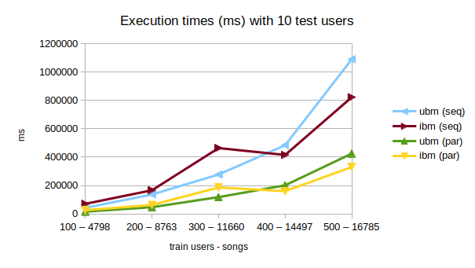
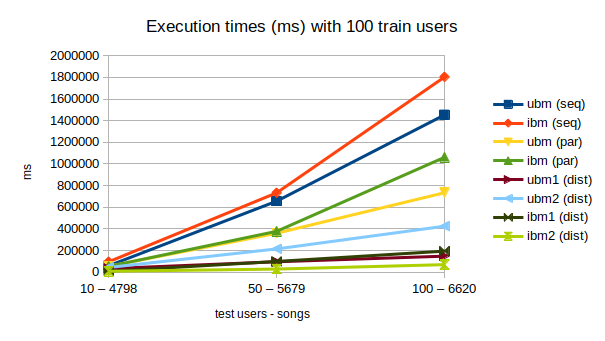
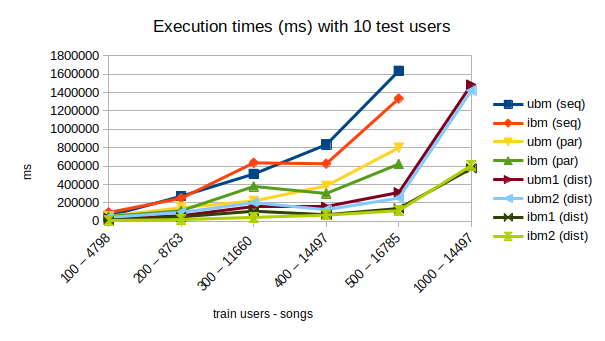

# Music Recommendation
Repository for the project of the Scalable and Cloud Computing course @unibo, a.y. 2022-23.

Inspired by the Million Song Dataset challenge on Kaggle, a comparison of various solutions to the problem
exploiting the MapReduce paradigm and providing an environment for sequential, parallel and distributed
execution. Hence, we aim to provide not only a comparison between the different algorithms, but also an
analysis of the behaviours of these algorithms across the different executions.

The different algorithms produced can be found in the `src/main/scala/` directory as scala worksheet
files. To execute the algorithms, one should download the <b>Echo Nest Taste Profile Subset</b> dataset from
http://millionsongdataset.com/tasteprofile/ and place the `train_triplets.txt` file under the `src/main/resources/`
directory (we advise working on a subset of it; `dataExtraction.ipynb` can be a useful tool to do that).
Once executed, the results of the training will be available through a text file with the same name of the
algorithm which can be found under `target/scala-2.12/classes/models/`. Make sure to also have an empty file in
`src/main/resources/models/` with the same name of the model (in case not, create it, as it will be used to dynamically
create the path for the output model, which will still be found under the `target/scala-2.12/classes/models/` path).

We plan to implement the following algorithms:
- UserBasedModel
- ItemBasedModel
- LinearCombinationModel
- AggregationModel
- StochasticAggregationModel

## How to execute code on Google Cloud Platform
1. Be sure that:
    * Every file path in code is in the local path (e.g., "train_100_50.txt" instead of "~/MusicRecommender/.../train_100_50.txt")
    * All files are loaded with `Source.fromResource` instead of `Source.fromFile`
    * You have already created a Google Cloud Project ([here's a guide](https://cloud.google.com/dataproc/docs/guides/setup-project))
    * You have already installed Google Cloud CLI ([here's a guide](https://cloud.google.com/sdk/docs/install))
2. Create an assembly *.jar* package using the following command (in the project directory):
   ```sh
   sbt clean assembly
   ```
   * (Optional, but strongly recommended) You can check if the code works: go to `MusicReccomender/target/scala-2.12/` and run
     ```shell
       java -jar package.jar
       ```
3. Create a new bucket inside the project in Google Cloud Platform (in this example it is called `mr`)
4. Copy the package created inside `MusicReccomender/target/scala-2.12/` to the bucket with the following command:
   ```shell
   gsutil cp package.jar gs://mr
   ```
5. Create a Compute Engine Cluster on Google Cloud Platform
    * Be careful to choose the correct linux image, which is *2.1 (Debian 11, Hadoop 3.3, Spark 3.3) first release: 22/01/2021*
    * You can plan the elimination of the cluster so that you won't waste credits 
6. Create and send a new job by:
   1. Selecting the created cluster
   2. Choosing *Spark* job  as "Type of job"
   3. Typing `gs://mr/package.jar` in "Main class or jar" 

## Some notes about some choices made during the project

### getModel alternatives:

- using only map:

```
songs.map(s => if (!testUsersToSongsMap(user).contains(s)) user -> (s, rank(user, s)) else user -> (s, 0.0))
```

- using external map and internal for:

```
songs map (s => {
  for {
    u <- testUsers filter (u => !testUsersToSongsMap(u).contains(s))
  } yield u -> (s, rank(u, s))
})
```

- using only for:

```
for {
  s <- songs
  u <- testUsers
  if !testUsersToSongsMap(u).contains(s)
} yield u -> (s, rank(u, s))
```

The latter has been (experimentally) proven to be the most efficient for both sequential and parallel computations,
while in the distributed version the second works better, as we can distribute only on one RDD (more considerations on
this later). This is because the for construct is, in fact, "syntax sugar" provided by Scala, which optimizes this kind
of operation behind the curtains.

- Parallel version of the third alternative:

```
for {
  s <- songs.iterator.toSeq.par
  u <- testUsers.iterator.toSeq.par
  if !testUsersToSongsMap(u).contains(s)
} yield u -> (s, rank(u, s))
```

In the for construct over both structures, the if statement has been proven to work better than the filter, differently
from the other cases (i.e., for over one single structure and map). Keep in mind that filter is preferable wrt the if
statement in a parallelized environment as it could cause errors in races condition; however, this is not our case, and
therefore we can make use of the better efficiency of if in our code.

- Distributed version of the second alternative:

```
object _BasedModel {

  ...

  def getRanks1(user: String):ParSeq[(String, (String, Double))] = {
    // foreach song, calculate the score for the user
    for {
      song <- songs.iterator.toSeq.par filter (song => !testUsersToSongsMap(user).contains(song))
    } yield {
      user -> (song, rank(user, song))
    }
  }

  def getRanks2(song: String): ParSeq[(String, (String, Double))] = {
    // foreach user, calculate the score for the user
    for {
      user <- testUsers.iterator.toSeq.par filter (user => !testUsersToSongsMap(user).contains(song))
    } yield {
      user -> (song, rank(user, song))
    }
  }
}

...

ctx.parallelize(testUsers).map(user => _BasedModel.getRanks1(user).seq).collect.flatten
ctx.parallelize(songs).map(song => _BasedModel.getRanks2(song).seq).collect.flatten

```

About distribution, we also have to take in account the number of nodes and cores per node that we can use. For
instance, in our case dividing the computation over the songs has proven to be better than dividing over the number of
users in all the experiments, therefore if we had more nodes than cores per node we would distribute over the songs
mapping them over the getRanks2 function; otherwise, if we had more cores per node rather than nodes, we would
distribute over the users mapping them over the getRanks1 function and making use of the greater parallelization
happening inside every single node. The same valuations stand in case for some reason the number of users grows
exponentially while the number of songs stays the same.

## Experiments

We designed three kind of experiments: the first two are meant to compare the scalability of the proposed solution and the
efficiency of the models scaling on the number of test (1) or train (2) users, while the third one is meant to compare
the models to find which one is the best, using as evaluation function the mean average precision, following the
challenge spirit in which the problem has first been proposed (Kaggle); this is done only on the distributed version on
Google Cloud Platform, making use of the proven scalability to compute the models on a much bigger dataset.

### Local Experiments

The following results are obtained on an Intel® Core™ i5-8250U Processor, 6M Cache, up to 3.40 GHz, 4 cores, 8 threads.
All times are in ms.


#### Incrementing the number of test users

- Sequential:

| TrainUsers | TestUsers | Songs |  ubm   | ibm     |
|------------|-----------|-------|--------|---------|
| 100        | 10        | 4798  | 42857  | 70839   |
| 100        | 50        | 5679  | 253379 | 516129  |
| 100        | 100       | 6620  | 739567 | 1403311 |

- Parallel:

| TrainUsers | TestUsers | Songs | ubm    | ibm    | 
|------------|-----------|-------|--------|--------|
| 100        | 10        | 4798  | 15507  | 25829  |
| 100        | 50        | 5679  | 105049 | 233113 |
| 100        | 100       | 6620  | 210372 | 402987 |


#### Incrementing the number of train users

- Sequential:

| TrainUsers | TestUsers | Songs | ubm     | ibm    |
|------------|-----------|-------|---------|--------|
| 100        | 10        | 4798  | 42857   | 70839  |
| 200        | 10        | 8763  | 136434  | 166437 |
| 300        | 10        | 11660 | 277385  | 464244 |
| 400        | 10        | 14497 | 484250  | 415634 |
| 500        | 10        | 16785 | 1090257 | 823119 |

- Parallel:

| TrainUsers | TestUsers | Songs | ubm    | ibm    | 
|------------|-----------|-------|--------|--------|
| 100        | 10        | 4798  | 15507  | 25829  |
| 200        | 10        | 8763  | 46980  | 63112  |
| 300        | 10        | 11660 | 118278 | 185948 |
| 400        | 10        | 14497 | 201378 | 159863 |
| 500        | 10        | 16785 | 425118 | 330385 |



### Google Cloud Platform Results

The following sequential and parallel results are obtained on a single node with a Google's N1 Processor with 4 virtual
CPUs and 15GB of RAM, while distributed results are obtained on 4 worker nodes, each with a Google's N1 Processor with
4 virtual CPUs and 15GB of RAM. All times are in ms.

Regarding the distributed execution, we reported the results for both approaches (distributing over songs and locally
parallelize over test users and vice versa), to study their behaviour over different numbers of users and songs. 

#### Incrementing the number of Test Users

- Sequential:

| TrainUsers | TestUsers | Songs | ubm     | ibm     |
|------------|-----------|-------|---------|---------|
| 100        | 10        | 4798  | 58175   | 95395   |
| 100        | 50        | 5679  | 655528  | 732643  |
| 100        | 100       | 6620  | 1453406 | 1803859 |

- Parallel:

| TrainUsers | TestUsers | Songs |  ubm   | ibm     |
|------------|-----------|-------|--------|---------|
| 100        | 10        | 4798  | 53851  | 52474   |
| 100        | 50        | 5679  | 359120 | 376764  |
| 100        | 100       | 6620  | 733755 | 1061279 |

- Distributed:

| TrainUsers | TestUsers | Songs | ubm1   | ubm2   | ibm1   | ibm2  |
|------------|-----------|-------|--------|--------|--------|-------|
| 100        | 10        | 4798  | 32020  | 42351  | 7790   | 7126  |
| 100        | 50        | 5679  | 95183  | 213722 | 98225  | 27701 |
| 100        | 100       | 6620  | 147121 | 424269 | 193660 | 68685 |



#### Incrementing the number of Train Users

- Sequential:

| TrainUsers | TestUsers | Songs | ubm     | ibm     | 
|------------|-----------|-------|---------|---------|
| 100        | 10        | 4798  | 58175   | 95395   |
| 200        | 10        | 8763  | 272104  | 249830  |
| 300        | 10        | 11660 | 513474  | 635022  |
| 400        | 10        | 14497 | 832376  | 625668  |
| 500        | 10        | 16785 | 1635081 | 1334183 |

- Parallel:

| TrainUsers | TestUsers | Songs | ubm    | ibm    | 
|------------|-----------|-------|--------|--------|
| 100        | 10        | 4798  | 53851  | 52474  |
| 200        | 10        | 8763  | 146988 | 113650 |
| 300        | 10        | 11660 | 220897 | 378365 |
| 400        | 10        | 14497 | 384275 | 301811 |
| 500        | 10        | 16785 | 799185 | 622275 |

- Distributed

| TrainUsers | TestUsers | Songs | ubm1    | ubm2    | ibm1   | ibm2   |
|------------|-----------|-------|---------|---------|--------|--------|
| 100        | 10        | 4798  | 32020   | 42351   | 7790   | 7126   |
| 200        | 10        | 8763  | 59725   | 95462   | 47734  | 18244  |
| 300        | 10        | 11660 | 162974  | 202068  | 109075 | 42347  |
| 400        | 10        | 14497 | 155877  | 125346  | 70841  | 66695  |
| 500        | 10        | 16785 | 313024  | 250710  | 138590 | 114828 |
| 1000       | 10        | 17748 | 1484891 | 1420594 | 574715 | 606498 |



### Models comparison over 1000 train users and 100 test users

For each model, its mean average precision (mAP) value is reported.

| Songs   | NewSongs | ubm           | ibm         | lcm          | am           | scm         |
|---------|----------|---------------|-------------|--------------|--------------|-------------|
| 28720   | 2176     |  0.0385800219 | 0.142942848 | 0.1369886698 | 0.0950991402 | 0.101490377 |

Classification:
1. Item based model
2. Linear combination model
3. Stochastic combination model
4. Aggregation model
5. User based model


### Models comparison over 2000 train users and 100 test users

For each model, its mean average precision (mAP) value is reported.

| Songs   | NewSongs | ubm           | ibm          | lcm          | am           | scm         |
|---------|----------|---------------|--------------|--------------|--------------|-------------|
| 44451   | 1865     |  0.0296820445 | 0.1549078628 | 0.0923070961 | 0.0770281485 | 0.0666806146 |

Classification:
1. Item based model
2. Linear combination model
3. Aggregation model
4. Stochastic combination model
5. User based model


### Some notes about combination models and future experiments

All combination models have been realized such that a parameter `alpha` specifies how to weight the contributions from
the user based and the item based model (as `alpha` and `1 - alpha`, respectively). This means that one could eventually
try all combinations of contributions from the two models, possibly finding a value for `alpha` such that at least the
linear combination model gives better results than one singular model (in out case, the item based model), as it happens
in the paper. For example, in our case one could think to weight the item based model more than the user based one
(`alpha=0.5` by default, giving the same weights to both models). It is also possible to calculate the two models
separately and then importing them in a new execution to try these experiments on combinations without the need to
recompute both models each time.

### Experiment logs

<details> 
<summary>Results with 100 train users and 10 test users</summary>

* Songs: 4798
* New songs: 262
* Elapsed time for (Sequential) user-based model:	42857ms (42857364180ns)
* Elapsed time for (Parallel) user-based model:	15507ms (15507377234ns)
* Elapsed time for (Sequential) item-based model:	70839ms (70839461276ns)
* Elapsed time for (Parallel) item-based model:	25829ms (25829145704ns)
* Elapsed time for (Sequential) linear-combination model:	25ms (25468308ns)
* Elapsed time for (Parallel) linear-combination model:	18ms (18808361ns)
* Elapsed time for (Sequential) aggregation model:	25ms (25376443ns)
* Elapsed time for (Parallel) aggregation model:	22ms (22824598ns)
* Elapsed time for (Sequential) stochastic-combination model:	22ms (22814212ns)
* Elapsed time for (Parallel) stochastic-combination model:	18ms (18587216ns)
* Elapsed time for (Sequential) user-based model mAP:	441ms (441693398ns)
* Elapsed time for (Parallel) user-based model mAP:	165ms (165774138ns)
* Elapsed time for (Sequential) item-based model mAP:	461ms (461173721ns)
* Elapsed time for (Parallel) item-based model mAP:	180ms (180187672ns)
* Elapsed time for (Sequential) linear-combination model mAP:	398ms (398532015ns)
* Elapsed time for (Parallel) linear-combination model mAP:	172ms (172372507ns)
* Elapsed time for (Sequential) aggregation model mAP:	312ms (312546899ns)
* Elapsed time for (Parallel) aggregation model mAP:	152ms (152993251ns)
* Elapsed time for (Sequential) stochastic-combination model mAP:	242ms (242267654ns)
* Elapsed time for (Parallel) stochastic-combination model mAP:	96ms (96231460ns)
* (Sequential) user-based model mAP: 0.0618047983
* (Parallel) user-based model mAP: 0.0618047983
* (Sequential) item-based model mAP: 0.0990458015
* (Parallel) item-based model mAP: 0.0990458015
* (Sequential) linear-combination model mAP: 0.1025445293
* (Parallel) linear-combination model mAP: 0.1025445293
* (Sequential) aggregation model model mAP: 0.0637131952
* (Parallel) aggregation model mAP: 0.0637131952
* (Sequential) stochastic-combination model mAP: 0.0676572156
* (Parallel) stochastic-combination model mAP: 0.0766630316

</details>

<details> 
<summary>Results with 100 train users and 50 test users</summary>

* Songs: 5679
* New songs: 1394
* Elapsed time for (Sequential) user-based model:	253379ms (253379538871ns)
* Elapsed time for (Parallel) user-based model:	105049ms (105049963306ns)
* Elapsed time for (Sequential) item-based model:	516129ms (516129726810ns)
* Elapsed time for (Parallel) item-based model:	233113ms (233113107429ns)
* Elapsed time for (Sequential) linear-combination model:	79ms (79054214ns)
* Elapsed time for (Parallel) linear-combination model:	108ms (108582538ns)
* Elapsed time for (Sequential) aggregation model:	168ms (168176485ns)
* Elapsed time for (Parallel) aggregation model:	125ms (125442087ns)
* Elapsed time for (Sequential) stochastic-combination model:	104ms (104458823ns)
* Elapsed time for (Parallel) stochastic-combination model:	94ms (94851867ns)
* Elapsed time for (Sequential) user-based model mAP:	4352ms (4352763743ns)
* Elapsed time for (Parallel) user-based model mAP:	1970ms (1970362190ns)
* Elapsed time for (Sequential) item-based model mAP:	5411ms (5411032642ns)
* Elapsed time for (Parallel) item-based model mAP:	2138ms (2138962086ns)
* Elapsed time for (Sequential) linear-combination model mAP:	5562ms (5562102258ns)
* Elapsed time for (Parallel) linear-combination model mAP:	1624ms (1624478566ns)
* Elapsed time for (Sequential) aggregation model mAP:	6203ms (6203478859ns)
* Elapsed time for (Parallel) aggregation model mAP:	1806ms (1806769783ns)
* Elapsed time for (Sequential) stochastic-combination model mAP:	4919ms (4919265860ns)
* Elapsed time for (Parallel) stochastic-combination model mAP:	1396ms (1396721153ns)
* (Sequential) user-based model mAP: 0.0320140683
* (Parallel) user-based model mAP: 0.0320140683
* (Sequential) item-based model mAP: 0.0730435327
* (Parallel) item-based model mAP: 0.0730435327
* (Sequential) linear-combination model mAP: 0.0732291573
* (Parallel) linear-combination model mAP: 0.0732291573
* (Sequential) aggregation model model mAP: 0.0461427795
* (Parallel) aggregation model mAP: 0.0461427795
* (Sequential) stochastic-combination model mAP: 0.054275165
* (Parallel) stochastic-combination model mAP: 0.0504545796

</details>

<details> 
<summary>Results with 100 train users and 100 test users</summary>

* Songs: 6620
* New songs: 2480
* Elapsed time for (Sequential) user-based model:	739567ms (739567071965ns)
* Elapsed time for (Parallel) user-based model:	210372ms (210372828326ns)
* Elapsed time for (Sequential) item-based model:	1403311ms (1403311659284ns)
* Elapsed time for (Parallel) item-based model:	402987ms (402987760631ns)
* Elapsed time for (Sequential) linear-combination model:	194ms (194027395ns)
* Elapsed time for (Parallel) linear-combination model:	146ms (146129808ns)
* Elapsed time for (Sequential) aggregation model:	282ms (282815925ns)
* Elapsed time for (Parallel) aggregation model:	242ms (242000556ns)
* Elapsed time for (Sequential) stochastic-combination model:	195ms (195633915ns)
* Elapsed time for (Parallel) stochastic-combination model:	121ms (121013083ns)
* Elapsed time for (Sequential) user-based model mAP:	17711ms (17711445931ns)
* Elapsed time for (Parallel) user-based model mAP:	5738ms (5738134130ns)
* Elapsed time for (Sequential) item-based model mAP:	18828ms (18828945757ns)
* Elapsed time for (Parallel) item-based model mAP:	6157ms (6157341845ns)
* Elapsed time for (Sequential) linear-combination model mAP:	20731ms (20731335757ns)
* Elapsed time for (Parallel) linear-combination model mAP:	5324ms (5324153841ns)
* Elapsed time for (Sequential) aggregation model mAP:	17257ms (17257004635ns)
* Elapsed time for (Parallel) aggregation model mAP:	6826ms (6826038612ns)
* Elapsed time for (Sequential) stochastic-combination model mAP:	14665ms (14665562865ns)
* Elapsed time for (Parallel) stochastic-combination model mAP:	6211ms (6211425487ns)
* (Sequential) user-based model mAP: 0.0165354986
* (Parallel) user-based model mAP: 0.0165354986
* (Sequential) item-based model mAP: 0.0394516174
* (Parallel) item-based model mAP: 0.0394516174
* (Sequential) linear-combination model mAP: 0.0404551622
* (Parallel) linear-combination model mAP: 0.0404551622
* (Sequential) aggregation model model mAP: 0.026037198
* (Parallel) aggregation model mAP: 0.026037198
* (Sequential) stochastic-combination model mAP: 0.0272929769
* (Parallel) stochastic-combination model mAP: 0.0232938355

</details>

<details> 
<summary>Results with 200 train users and 10 test users</summary>

* Songs: 8763
* New songs: 180
* Elapsed time for (Sequential) user-based model:	136434ms (136434211069ns)
* Elapsed time for (Parallel) user-based model:	46980ms (46980268034ns)
* Elapsed time for (Sequential) item-based model:	166437ms (166437036452ns)
* Elapsed time for (Parallel) item-based model:	63112ms (63112854374ns)
* Elapsed time for (Sequential) linear-combination model:	35ms (35896897ns)
* Elapsed time for (Parallel) linear-combination model:	25ms (25774293ns)
* Elapsed time for (Sequential) aggregation model:	50ms (50446720ns)
* Elapsed time for (Parallel) aggregation model:	28ms (28951610ns)
* Elapsed time for (Sequential) stochastic-combination model:	32ms (32615643ns)
* Elapsed time for (Parallel) stochastic-combination model:	31ms (31329748ns)
* Elapsed time for (Sequential) user-based model mAP:	430ms (430709814ns)
* Elapsed time for (Parallel) user-based model mAP:	231ms (231304470ns)
* Elapsed time for (Sequential) item-based model mAP:	607ms (607535794ns)
* Elapsed time for (Parallel) item-based model mAP:	283ms (283896505ns)
* Elapsed time for (Sequential) linear-combination model mAP:	564ms (564789426ns)
* Elapsed time for (Parallel) linear-combination model mAP:	314ms (314617792ns)
* Elapsed time for (Sequential) aggregation model mAP:	440ms (440703079ns)
* Elapsed time for (Parallel) aggregation model mAP:	224ms (224796267ns)
* Elapsed time for (Sequential) stochastic-combination model mAP:	472ms (472007082ns)
* Elapsed time for (Parallel) stochastic-combination model mAP:	243ms (243478770ns)
* (Sequential) user-based model mAP: 0.0674074074
* (Parallel) user-based model mAP: 0.0674074074
* (Sequential) item-based model mAP: 0.1117592593
* (Parallel) item-based model mAP: 0.1117592593
* (Sequential) linear-combination model mAP: 0.1085185185
* (Parallel) linear-combination model mAP: 0.1085185185
* (Sequential) aggregation model model mAP: 0.1066666667
* (Parallel) aggregation model mAP: 0.1066666667
* (Sequential) stochastic-combination model mAP: 0.0787962963
* (Parallel) stochastic-combination model mAP: 0.0926851852

</details>

<details> 
<summary>Results with 300 train users and 10 test users</summary>

* Songs: 11660
* New songs: 299
* Elapsed time for (Sequential) user-based model:	277385ms (277385960888ns)
* Elapsed time for (Parallel) user-based model:	118278ms (118278364427ns)
* Elapsed time for (Sequential) item-based model:	464244ms (464244584608ns)
* Elapsed time for (Parallel) item-based model:	185948ms (185948456337ns)
* Elapsed time for (Sequential) linear-combination model:	44ms (44629761ns)
* Elapsed time for (Parallel) linear-combination model:	33ms (33530636ns)
* Elapsed time for (Sequential) aggregation model:	55ms (55272364ns)
* Elapsed time for (Parallel) aggregation model:	67ms (67517837ns)
* Elapsed time for (Sequential) stochastic-combination model:	42ms (42072013ns)
* Elapsed time for (Parallel) stochastic-combination model:	19ms (19174736ns)
* Elapsed time for (Sequential) user-based model mAP:	716ms (716026485ns)
* Elapsed time for (Parallel) user-based model mAP:	407ms (407989568ns)
* Elapsed time for (Sequential) item-based model mAP:	1136ms (1136933714ns)
* Elapsed time for (Parallel) item-based model mAP:	457ms (457322012ns)
* Elapsed time for (Sequential) linear-combination model mAP:	932ms (932210084ns)
* Elapsed time for (Parallel) linear-combination model mAP:	432ms (432270977ns)
* Elapsed time for (Sequential) aggregation model mAP:	737ms (737421888ns)
* Elapsed time for (Parallel) aggregation model mAP:	281ms (281846488ns)
* Elapsed time for (Sequential) stochastic-combination model mAP:	716ms (716559469ns)
* Elapsed time for (Parallel) stochastic-combination model mAP:	275ms (275453178ns)
* (Sequential) user-based model mAP: 0.1521579869
* (Parallel) user-based model mAP: 0.1521579869
* (Sequential) item-based model mAP: 0.2049370919
* (Parallel) item-based model mAP: 0.2049370919
* (Sequential) linear-combination model mAP: 0.2063306259
* (Parallel) linear-combination model mAP: 0.2063306259
* (Sequential) aggregation model model mAP: 0.1652810957
* (Parallel) aggregation model mAP: 0.1652810957
* (Sequential) stochastic-combination model mAP: 0.1807214525
* (Parallel) stochastic-combination model mAP: 0.1717590381

</details>

<details> 
<summary>Results with 400 train users and 10 test users</summary>

* Songs: 14497
* New songs: 155
* Elapsed time for (Sequential) user-based model:	484250ms (484250895513ns)
* Elapsed time for (Parallel) user-based model:	201378ms (201378619877ns)
* Elapsed time for (Sequential) item-based model:	415634ms (415634469106ns)
* Elapsed time for (Parallel) item-based model:	159863ms (159863170761ns)
* Elapsed time for (Sequential) linear-combination model:	47ms (47734294ns)
* Elapsed time for (Parallel) linear-combination model:	37ms (37730827ns)
* Elapsed time for (Sequential) aggregation model:	55ms (55604232ns)
* Elapsed time for (Parallel) aggregation model:	45ms (45141359ns)
* Elapsed time for (Sequential) stochastic-combination model:	40ms (40383968ns)
* Elapsed time for (Parallel) stochastic-combination model:	45ms (45322117ns)
* Elapsed time for (Sequential) user-based model mAP:	704ms (704006043ns)
* Elapsed time for (Parallel) user-based model mAP:	453ms (453804142ns)
* Elapsed time for (Sequential) item-based model mAP:	725ms (725913616ns)
* Elapsed time for (Parallel) item-based model mAP:	420ms (420842369ns)
* Elapsed time for (Sequential) linear-combination model mAP:	736ms (736513671ns)
* Elapsed time for (Parallel) linear-combination model mAP:	389ms (389822436ns)
* Elapsed time for (Sequential) aggregation model mAP:	599ms (599806086ns)
* Elapsed time for (Parallel) aggregation model mAP:	356ms (356975997ns)
* Elapsed time for (Sequential) stochastic-combination model mAP:	589ms (589438205ns)
* Elapsed time for (Parallel) stochastic-combination model mAP:	386ms (386097244ns)
* (Sequential) user-based model mAP: 0.143609831
* (Parallel) user-based model mAP: 0.143609831
* (Sequential) item-based model mAP: 0.1968356375
* (Parallel) item-based model mAP: 0.1968356375
* (Sequential) linear-combination model mAP: 0.2011367127
* (Parallel) linear-combination model mAP: 0.2011367127
* (Sequential) aggregation model model mAP: 0.1312442396
* (Parallel) aggregation model mAP: 0.1312442396
* (Sequential) stochastic-combination model mAP: 0.1542089094
* (Parallel) stochastic-combination model mAP: 0.1542089094

</details>

<details> 
<summary>Results with 500 train users and 10 test users</summary>

* Songs: 16785
* New songs: 244
* Elapsed time for (Sequential) user-based model:	1090257ms (1090257841293ns)
* Elapsed time for (Parallel) user-based model:	425118ms (425118696144ns)
* Elapsed time for (Sequential) item-based model:	823119ms (823119431191ns)
* Elapsed time for (Parallel) item-based model:	330385ms (330385806410ns)
* Elapsed time for (Sequential) linear-combination model:	61ms (61367983ns)
* Elapsed time for (Parallel) linear-combination model:	36ms (36519326ns)
* Elapsed time for (Sequential) aggregation model:	67ms (67567455ns)
* Elapsed time for (Parallel) aggregation model:	44ms (44929172ns)
* Elapsed time for (Sequential) stochastic-combination model:	110ms (110850397ns)
* Elapsed time for (Parallel) stochastic-combination model:	78ms (78716238ns)
* Elapsed time for (Sequential) user-based model mAP:	971ms (971745933ns)
* Elapsed time for (Parallel) user-based model mAP:	614ms (614552047ns)
* Elapsed time for (Sequential) item-based model mAP:	1060ms (1060226717ns)
* Elapsed time for (Parallel) item-based model mAP:	501ms (501448199ns)
* Elapsed time for (Sequential) linear-combination model mAP:	963ms (963367047ns)
* Elapsed time for (Parallel) linear-combination model mAP:	467ms (467187741ns)
* Elapsed time for (Sequential) aggregation model mAP:	1031ms (1031745672ns)
* Elapsed time for (Parallel) aggregation model mAP:	410ms (410641312ns)
* Elapsed time for (Sequential) stochastic-combination model mAP:	740ms (740897767ns)
* Elapsed time for (Parallel) stochastic-combination model mAP:	290ms (290752657ns)
* (Sequential) user-based model mAP: 0.1661316029
* (Parallel) user-based model mAP: 0.1661316029
* (Sequential) item-based model mAP: 0.280976776
* (Parallel) item-based model mAP: 0.280976776
* (Sequential) linear-combination model mAP: 0.2721116315
* (Parallel) linear-combination model mAP: 0.2721116315
* (Sequential) aggregation model model mAP: 0.2748162243
* (Parallel) aggregation model mAP: 0.2748162243
* (Sequential) stochastic-combination model mAP: 0.2099743039
* (Parallel) stochastic-combination model mAP: 0.210208496

</details>

<details>
	<summary>GCP with 100 train users and 10 test users</summary>

* Songs: 4798
* New songs: 262
* Elapsed time for (Sequential) user-based model:	58175ms (58175637838ns)
* Elapsed time for (Parallel) user-based model:	53851ms (53851335760ns)
* Elapsed time for (Distributed) user-based1:	32020ms (32020236095ns)
* Elapsed time for (Distributed) user-based2:	42351ms (42351342324ns)
* Elapsed time for (Sequential) item-based model:	95395ms (95395813912ns)
* Elapsed time for (Parallel) item-based model:	52474ms (52474346061ns)
* Elapsed time for (Distributed) item-based1:	7790ms (7790517548ns)
* Elapsed time for (Distributed) item-based2:	7126ms (7126385975ns)
* Elapsed time for (Sequential) linear-combination model:	43ms (43001399ns)
* Elapsed time for (Parallel) linear-combination model:	30ms (30947247ns)
* Elapsed time for (Distributed) linear combination:	929ms (929160615ns)
* Elapsed time for (Sequential) aggregation model:	37ms (37521982ns)
* Elapsed time for (Parallel) aggregation model:	71ms (71014601ns)
* Elapsed time for (Distributed) aggregation model:	658ms (658879738ns)
* Elapsed time for (Sequential) stochastic-combination model:	29ms (29390764ns)
* Elapsed time for (Parallel) stochastic-combination model:	21ms (21979575ns)
* Elapsed time for (Distributed) stochastic combination model:	484ms (484372595ns)
* Elapsed time for (Sequential) user-based model mAP:	452ms (452958276ns)
* Elapsed time for (Parallel) user-based model mAP:	207ms (207369356ns)
* Elapsed time for (Distributed) user-based model mAP:	635ms (635369429ns)
* Elapsed time for (Sequential) item-based model mAP:	576ms (576920448ns)
* Elapsed time for (Parallel) item-based model mAP:	355ms (355273819ns)
* Elapsed time for (Distributed) item-based model mAP:	387ms (387956319ns)
* Elapsed time for (Sequential) linear-combination model mAP:	510ms (510430481ns)
* Elapsed time for (Parallel) linear-combination model mAP:	299ms (299033756ns)
* Elapsed time for (Distributed) linear-combination model mAP:	377ms (377338776ns)
* Elapsed time for (Sequential) aggregation model mAP:	395ms (395335099ns)
* Elapsed time for (Parallel) aggregation model mAP:	216ms (216700655ns)
* Elapsed time for (Distributed) aggregation model mAP:	425ms (425087107ns)
* Elapsed time for (Sequential) stochastic-combination model mAP:	339ms (339214053ns)
* Elapsed time for (Parallel) stochastic-combination model mAP:	195ms (195296050ns)
* Elapsed time for (Distributed) stochastic-combination model mAP:	343ms (343252870ns)
* (Sequential) user-based model mAP: 0.0618047983
* (Parallel) user-based model mAP: 0.0618047983
* (Distributed) user-based model mAP: 0.0618047983
* (Sequential) item-based model mAP: 0.0990458015
* (Parallel) item-based model mAP: 0.0990458015
* (Distributed) item-based model mAP: 0.0990458015
* (Sequential) linear-combination model mAP: 0.1025445293
* (Parallel) linear-combination model mAP: 0.1025445293
* (Distributed) linear-combination model mAP: 0.1025445293
* (Sequential) aggregation model model mAP: 0.0637131952
* (Parallel) aggregation model mAP: 0.0637131952
* (Distributed) aggregation model model mAP: 0.0637131952
* (Sequential) stochastic-combination model mAP: 0.0682569975
* (Parallel) stochastic-combination model mAP: 0.0751272265
* (Distributed) stochastic-combination model mAP: 0.069692839

</details>

<details>
	<summary>GCP with 100 train users and 50 test users</summary>

* Songs: 5679
* New songs: 1394
* Elapsed time for (Sequential) user-based model:	655528ms (655528740788ns)
* Elapsed time for (Parallel) user-based model:	359120ms (359120014416ns)
* Elapsed time for (Distributed) user-based1:	95183ms (95183929502ns)
* Elapsed time for (Distributed) user-based2:	213722ms (213722236503ns)
* Elapsed time for (Sequential) item-based model:	732643ms (732643430327ns)
* Elapsed time for (Parallel) item-based model:	376764ms (376764789156ns)
* Elapsed time for (Distributed) item-based1:	98225ms (98225442292ns)
* Elapsed time for (Distributed) item-based2:	27701ms (27701237273ns)
* Elapsed time for (Sequential) linear-combination model:	114ms (114233213ns)
* Elapsed time for (Parallel) linear-combination model:	103ms (103899498ns)
* Elapsed time for (Distributed) linear combination:	2560ms (2560212721ns)
* Elapsed time for (Sequential) aggregation model:	283ms (283632211ns)
* Elapsed time for (Parallel) aggregation model:	240ms (240741137ns)
* Elapsed time for (Distributed) aggregation model:	2439ms (2439683732ns)
* Elapsed time for (Sequential) stochastic-combination model:	148ms (148734243ns)
* Elapsed time for (Parallel) stochastic-combination model:	98ms (98070158ns)
* Elapsed time for (Distributed) stochastic combination model:	2060ms (2060960893ns)
* Elapsed time for (Sequential) user-based model mAP:	6940ms (6940301366ns)
* Elapsed time for (Parallel) user-based model mAP:	3809ms (3809971695ns)
* Elapsed time for (Distributed) user-based model mAP:	4465ms (4465218766ns)
* Elapsed time for (Sequential) item-based model mAP:	7571ms (7571172538ns)
* Elapsed time for (Parallel) item-based model mAP:	3945ms (3945749021ns)
* Elapsed time for (Distributed) item-based model mAP:	4964ms (4964142348ns)
* Elapsed time for (Sequential) linear-combination model mAP:	7336ms (7336390079ns)
* Elapsed time for (Parallel) linear-combination model mAP:	3966ms (3966774390ns)
* Elapsed time for (Distributed) linear-combination model mAP:	4092ms (4092735442ns)
* Elapsed time for (Sequential) aggregation model mAP:	8849ms (8849501325ns)
* Elapsed time for (Parallel) aggregation model mAP:	4630ms (4630480849ns)
* Elapsed time for (Distributed) aggregation model mAP:	5817ms (5817036211ns)
* Elapsed time for (Sequential) stochastic-combination model mAP:	6581ms (6581419016ns)
* Elapsed time for (Parallel) stochastic-combination model mAP:	3488ms (3488122302ns)
* Elapsed time for (Distributed) stochastic-combination model mAP:	3103ms (3103679799ns)
* (Sequential) user-based model mAP: 0.0320140683
* (Parallel) user-based model mAP: 0.0320140683
* (Distributed) user-based model mAP: 0.0320140683
* (Sequential) item-based model mAP: 0.0730435327
* (Parallel) item-based model mAP: 0.0730435327
* (Distributed) item-based model mAP: 0.0730435327
* (Sequential) linear-combination model mAP: 0.0732291573
* (Parallel) linear-combination model mAP: 0.0732291573
* (Distributed) linear-combination model mAP: 0.0732291573
* (Sequential) aggregation model model mAP: 0.0461427795
* (Parallel) aggregation model mAP: 0.0461427795
* (Distributed) aggregation model model mAP: 0.0461427795
* (Sequential) stochastic-combination model mAP: 0.0544634029
* (Parallel) stochastic-combination model mAP: 0.0468094833
* (Distributed) stochastic-combination model mAP: 0.0528467816

</details>

<details>
	<summary>GCP with 100 train users and 100 test users</summary>

* Songs: 6620
* New songs: 2480
* Elapsed time for (Sequential) user-based model:	1453406ms (1453406413461ns)
* Elapsed time for (Parallel) user-based model:	733755ms (733755635985ns)
* Elapsed time for (Distributed) user-based1:	147121ms (147121170586ns)
* Elapsed time for (Distributed) user-based2:	424269ms (424269381726ns)
* Elapsed time for (Sequential) item-based model:	1803859ms (1803859724567ns)
* Elapsed time for (Parallel) item-based model:	1061279ms (1061279555871ns)
* Elapsed time for (Distributed) item-based1:	193660ms (193660286090ns)
* Elapsed time for (Distributed) item-based2:	68685ms (68685996627ns)
* Elapsed time for (Sequential) linear-combination model:	305ms (305689384ns)
* Elapsed time for (Parallel) linear-combination model:	403ms (403991220ns)
* Elapsed time for (Distributed) linear combination:	4315ms (4315320767ns)
* Elapsed time for (Sequential) aggregation model:	457ms (457062157ns)
* Elapsed time for (Parallel) aggregation model:	386ms (386013535ns)
* Elapsed time for (Distributed) aggregation model:	6069ms (6069394901ns)
* Elapsed time for (Sequential) stochastic-combination model:	577ms (577378045ns)
* Elapsed time for (Parallel) stochastic-combination model:	389ms (389767363ns)
* Elapsed time for (Distributed) stochastic combination model:	3783ms (3783811305ns)
* Elapsed time for (Sequential) user-based model mAP:	20357ms (20357906557ns)
* Elapsed time for (Parallel) user-based model mAP:	10999ms (10999264390ns)
* Elapsed time for (Distributed) user-based model mAP:	10193ms (10193798538ns)
* Elapsed time for (Sequential) item-based model mAP:	23144ms (23144904340ns)
* Elapsed time for (Parallel) item-based model mAP:	12996ms (12996608280ns)
* Elapsed time for (Distributed) item-based model mAP:	11333ms (11333303544ns)
* Elapsed time for (Sequential) linear-combination model mAP:	22430ms (22430335776ns)
* Elapsed time for (Parallel) linear-combination model mAP:	11414ms (11414745953ns)
* Elapsed time for (Distributed) linear-combination model mAP:	18913ms (18913232322ns)
* Elapsed time for (Sequential) aggregation model mAP:	24708ms (24708000927ns)
* Elapsed time for (Parallel) aggregation model mAP:	13230ms (13230178771ns)
* Elapsed time for (Distributed) aggregation model mAP:	18505ms (18505648503ns)
* Elapsed time for (Sequential) stochastic-combination model mAP:	20616ms (20616275484ns)
* Elapsed time for (Parallel) stochastic-combination model mAP:	10746ms (10746474657ns)
* Elapsed time for (Distributed) stochastic-combination model mAP:	11020ms (11020421021ns)
* (Sequential) user-based model mAP: 0.0165354986
* (Parallel) user-based model mAP: 0.0165354986
* (Distributed) user-based model mAP: 0.0165354986
* (Sequential) item-based model mAP: 0.0394516174
* (Parallel) item-based model mAP: 0.0394516174
* (Distributed) item-based model mAP: 0.0394516174
* (Sequential) linear-combination model mAP: 0.0404551622
* (Parallel) linear-combination model mAP: 0.0404551622
* (Distributed) linear-combination model mAP: 0.0404551622
* (Sequential) aggregation model model mAP: 0.026037198
* (Parallel) aggregation model mAP: 0.026037198
* (Distributed) aggregation model model mAP: 0.026037198
* (Sequential) stochastic-combination model mAP: 0.0301067135
* (Parallel) stochastic-combination model mAP: 0.0280217284
* (Distributed) stochastic-combination model mAP: 0.0290859303

</details>

<details>
	<summary>GCP with 200 train users and 10 test users</summary>

* Songs: 8763
* New songs: 180
* Elapsed time for (Sequential) user-based model:	272104ms (272104848879ns)
* Elapsed time for (Parallel) user-based model:	146988ms (146988939783ns)
* Elapsed time for (Distributed) user-based1:	59725ms (59725581508ns)
* Elapsed time for (Distributed) user-based2:	95462ms (95462669753ns)
* Elapsed time for (Sequential) item-based model:	249830ms (249830617586ns)
* Elapsed time for (Parallel) item-based model:	113650ms (113650211767ns)
* Elapsed time for (Distributed) item-based1:	47734ms (47734644822ns)
* Elapsed time for (Distributed) item-based2:	18244ms (18244475993ns)
* Elapsed time for (Sequential) linear-combination model:	47ms (47410182ns)
* Elapsed time for (Parallel) linear-combination model:	32ms (32178193ns)
* Elapsed time for (Distributed) linear combination:	1604ms (1604338317ns)
* Elapsed time for (Sequential) aggregation model:	69ms (69162881ns)
* Elapsed time for (Parallel) aggregation model:	49ms (49962981ns)
* Elapsed time for (Distributed) aggregation model:	1231ms (1231156378ns)
* Elapsed time for (Sequential) stochastic-combination model:	42ms (42390397ns)
* Elapsed time for (Parallel) stochastic-combination model:	45ms (45704704ns)
* Elapsed time for (Distributed) stochastic combination model:	1137ms (1137404684ns)
* Elapsed time for (Sequential) user-based model mAP:	467ms (467654374ns)
* Elapsed time for (Parallel) user-based model mAP:	371ms (371685224ns)
* Elapsed time for (Distributed) user-based model mAP:	1290ms (1290212320ns)
* Elapsed time for (Sequential) item-based model mAP:	862ms (862356942ns)
* Elapsed time for (Parallel) item-based model mAP:	520ms (520080699ns)
* Elapsed time for (Distributed) item-based model mAP:	1090ms (1090271325ns)
* Elapsed time for (Sequential) linear-combination model mAP:	709ms (709940618ns)
* Elapsed time for (Parallel) linear-combination model mAP:	469ms (469383492ns)
* Elapsed time for (Distributed) linear-combination model mAP:	741ms (741782964ns)
* Elapsed time for (Sequential) aggregation model mAP:	578ms (578254604ns)
* Elapsed time for (Parallel) aggregation model mAP:	390ms (390699269ns)
* Elapsed time for (Distributed) aggregation model mAP:	550ms (550742238ns)
* Elapsed time for (Sequential) stochastic-combination model mAP:	574ms (574419748ns)
* Elapsed time for (Parallel) stochastic-combination model mAP:	272ms (272123627ns)
* Elapsed time for (Distributed) stochastic-combination model mAP:	617ms (617888150ns)
* (Sequential) user-based model mAP: 0.0674074074
* (Parallel) user-based model mAP: 0.0674074074
* (Distributed) user-based model mAP: 0.0674074074
* (Sequential) item-based model mAP: 0.1117592593
* (Parallel) item-based model mAP: 0.1117592593
* (Distributed) item-based model mAP: 0.1117592593
* (Sequential) linear-combination model mAP: 0.1085185185
* (Parallel) linear-combination model mAP: 0.1085185185
* (Distributed) linear-combination model mAP: 0.1085185185
* (Sequential) aggregation model model mAP: 0.1066666667
* (Parallel) aggregation model mAP: 0.1066666667
* (Distributed) aggregation model model mAP: 0.1066666667
* (Sequential) stochastic-combination model mAP: 0.1040740741
* (Parallel) stochastic-combination model mAP: 0.0989814815
* (Distributed) stochastic-combination model mAP: 0.0757407407

</details>

<details>
	<summary>GCP with 300 train users and 10 test users</summary>

* Songs: 11660
* New songs: 299
* Elapsed time for (Sequential) user-based model:	513474ms (513474835482ns)
* Elapsed time for (Parallel) user-based model:	220897ms (220897243579ns)
* Elapsed time for (Distributed) user-based1:	162974ms (162974656940ns)
* Elapsed time for (Distributed) user-based2:	202068ms (202068498129ns)
* Elapsed time for (Sequential) item-based model:	635022ms (635022705931ns)
* Elapsed time for (Parallel) item-based model:	378365ms (378365846228ns)
* Elapsed time for (Distributed) item-based1:	109075ms (109075509142ns)
* Elapsed time for (Distributed) item-based2:	42347ms (42347346322ns)
* Elapsed time for (Sequential) linear-combination model:	60ms (60638515ns)
* Elapsed time for (Parallel) linear-combination model:	49ms (49544830ns)
* Elapsed time for (Distributed) linear combination:	1704ms (1704897767ns)
* Elapsed time for (Sequential) aggregation model:	76ms (76549110ns)
* Elapsed time for (Distributed) aggregation model:	1223ms (1223364907ns)
* Elapsed time for (Parallel) aggregation model:	46ms (46226635ns)
* Elapsed time for (Sequential) stochastic-combination model:	61ms (61203819ns)
* Elapsed time for (Parallel) stochastic-combination model:	43ms (43150582ns)
* Elapsed time for (Distributed) stochastic combination model:	1176ms (1176701812ns)
* Elapsed time for (Sequential) user-based model mAP:	1003ms (1003983244ns)
* Elapsed time for (Parallel) user-based model mAP:	524ms (524008462ns)
* Elapsed time for (Distributed) user-based model mAP:	1136ms (1136203413ns)
* Elapsed time for (Sequential) item-based model mAP:	1385ms (1385536381ns)
* Elapsed time for (Parallel) item-based model mAP:	756ms (756806573ns)
* Elapsed time for (Distributed) item-based model mAP:	1164ms (1164101859ns)
* Elapsed time for (Sequential) linear-combination model mAP:	1122ms (1122234784ns)
* Elapsed time for (Parallel) linear-combination model mAP:	706ms (706187033ns)
* Elapsed time for (Distributed) linear-combination model mAP:	1074ms (1074936398ns)
* Elapsed time for (Sequential) aggregation model mAP:	958ms (958655855ns)
* Elapsed time for (Parallel) aggregation model mAP:	510ms (510040426ns)
* Elapsed time for (Distributed) aggregation model mAP:	985ms (985196120ns)
* Elapsed time for (Sequential) stochastic-combination model mAP:	929ms (929581272ns)
* Elapsed time for (Parallel) stochastic-combination model mAP:	568ms (568268995ns)
* Elapsed time for (Distributed) stochastic-combination model mAP:	1476ms (1476176598ns)
* (Sequential) user-based model mAP: 0.1521579869
* (Parallel) user-based model mAP: 0.1521579869
* (Distributed) user-based model mAP: 0.1521579869
* (Sequential) item-based model mAP: 0.2049370919
* (Parallel) item-based model mAP: 0.2049370919
* (Distributed) item-based model mAP: 0.2049370919
* (Sequential) linear-combination model mAP: 0.2063306259
* (Parallel) linear-combination model mAP: 0.2063306259
* (Distributed) linear-combination model mAP: 0.2063306259
* (Sequential) aggregation model model mAP: 0.1652810957
* (Parallel) aggregation model mAP: 0.1652810957
* (Distributed) aggregation model model mAP: 0.1652810957
* (Sequential) stochastic-combination model mAP: 0.1789417105
* (Parallel) stochastic-combination model mAP: 0.1798375538
* (Distributed) stochastic-combination model mAP: 0.1719222806

</details>

<details>
	<summary>GCP with 400 train users and 10 test users</summary>

* Songs: 14497
* New songs: 155
* Elapsed time for (Sequential) user-based model:	832376ms (832376707399ns)
* Elapsed time for (Parallel) user-based model:	384275ms (384275605015ns)
* Elapsed time for (Distributed) user-based1:	155877ms (155877622249ns)
* Elapsed time for (Distributed) user-based2:	125346ms (125346254580ns)
* Elapsed time for (Sequential) item-based model:	625668ms (625668772218ns)
* Elapsed time for (Parallel) item-based model:	301811ms (301811331916ns)
* Elapsed time for (Distributed) item-based1:	70841ms (70841287114ns)
* Elapsed time for (Distributed) item-based2:	66695ms (66695686731ns)
* Elapsed time for (Sequential) linear-combination model:	81ms (81285222ns)
* Elapsed time for (Parallel) linear-combination model:	131ms (131164707ns)
* Elapsed time for (Distributed) linear combination:	1721ms (1721914413ns)
* Elapsed time for (Sequential) aggregation model:	101ms (101266968ns)
* Elapsed time for (Parallel) aggregation model:	84ms (84696671ns)
* Elapsed time for (Distributed) aggregation model:	1851ms (1851172322ns)
* Elapsed time for (Sequential) stochastic-combination model:	70ms (70677752ns)
* Elapsed time for (Parallel) stochastic-combination model:	67ms (67535615ns)
* Elapsed time for (Distributed) stochastic combination model:	1270ms (1270652268ns)
* Elapsed time for (Sequential) user-based model mAP:	826ms (826859843ns)
* Elapsed time for (Parallel) user-based model mAP:	550ms (550445058ns)
* Elapsed time for (Distributed) user-based model mAP:	933ms (933694767ns)
* Elapsed time for (Sequential) item-based model mAP:	1065ms (1065890482ns)
* Elapsed time for (Parallel) item-based model mAP:	754ms (754424823ns)
* Elapsed time for (Distributed) item-based model mAP:	685ms (685739359ns)
* Elapsed time for (Sequential) linear-combination model mAP:	990ms (990476621ns)
* Elapsed time for (Parallel) linear-combination model mAP:	685ms (685955805ns)
* Elapsed time for (Distributed) linear-combination model mAP:	885ms (885055663ns)
* Elapsed time for (Sequential) aggregation model mAP:	800ms (800535461ns)
* Elapsed time for (Parallel) aggregation model mAP:	574ms (574064035ns)
* Elapsed time for (Distributed) aggregation model mAP:	598ms (598422401ns)
* Elapsed time for (Sequential) stochastic-combination model mAP:	775ms (775346316ns)
* Elapsed time for (Parallel) stochastic-combination model mAP:	506ms (506862046ns)
* Elapsed time for (Distributed) stochastic-combination model mAP:	668ms (668666705ns)
* (Sequential) user-based model mAP: 0.143609831
* (Parallel) user-based model mAP: 0.143609831
* (Distributed) user-based model mAP: 0.143609831
* (Sequential) item-based model mAP: 0.1968356375
* (Parallel) item-based model mAP: 0.1968356375
* (Distributed) item-based model mAP: 0.1968356375
* (Sequential) linear-combination model mAP: 0.2011367127
* (Parallel) linear-combination model mAP: 0.2011367127
* (Distributed) linear-combination model mAP: 0.2011367127
* (Sequential) aggregation model model mAP: 0.1312442396
* (Parallel) aggregation model mAP: 0.1312442396
* (Distributed) aggregation model model mAP: 0.1312442396
* (Sequential) stochastic-combination model mAP: 0.1812442396
* (Parallel) stochastic-combination model mAP: 0.181781874
* (Distributed) stochastic-combination model mAP: 0.1753302611

</details>

<details>
	<summary>GCP with 500 train users and 10 test users</summary>

* Songs: 16785
* New songs: 244
* Elapsed time for (Sequential) user-based model:	1635081ms (1635081337343ns)
* Elapsed time for (Parallel) user-based model:	799185ms (799185599123ns)
* Elapsed time for (Distributed) user-based1:	313024ms (313024202265ns)
* Elapsed time for (Distributed) user-based2:	250710ms (250710844884ns)
* Elapsed time for (Sequential) item-based model:	1334183ms (1334183493280ns)
* Elapsed time for (Parallel) item-based model:	622275ms (622275174180ns)
* Elapsed time for (Distributed) item-based1:	138590ms (138590795829ns)
* Elapsed time for (Distributed) item-based2:	114828ms (114828347368ns)
* Elapsed time for (Sequential) linear-combination model:	80ms (80275271ns)
* Elapsed time for (Parallel) linear-combination model:	78ms (78162441ns)
* Elapsed time for (Distributed) linear combination:	2095ms (2095842940ns)
* Elapsed time for (Sequential) aggregation model:	122ms (122355039ns)
* Elapsed time for (Parallel) aggregation model:	75ms (75601571ns)
* Elapsed time for (Distributed) aggregation model:	2055ms (2055686834ns)
* Elapsed time for (Sequential) stochastic-combination model:	241ms (241857960ns)
* Elapsed time for (Parallel) stochastic-combination model:	139ms (139012745ns)
* Elapsed time for (Distributed) stochastic combination model:	1636ms (1636384274ns)
* Elapsed time for (Sequential) user-based model mAP:	1502ms (1502964618ns)
* Elapsed time for (Parallel) user-based model mAP:	894ms (894087673ns)
* Elapsed time for (Distributed) user-based model mAP:	1118ms (1118585507ns)
* Elapsed time for (Sequential) item-based model mAP:	1426ms (1426947763ns)
* Elapsed time for (Parallel) item-based model mAP:	835ms (835000030ns)
* Elapsed time for (Distributed) item-based model mAP:	999ms (999477942ns)
* Elapsed time for (Sequential) linear-combination model mAP:	1253ms (1253600616ns)
* Elapsed time for (Parallel) linear-combination model mAP:	847ms (847565595ns)
* Elapsed time for (Distributed) linear-combination model mAP:	1032ms (1032727448ns)
* Elapsed time for (Sequential) aggregation model mAP:	1253ms (1253506318ns)
* Elapsed time for (Parallel) aggregation model mAP:	681ms (681685749ns)
* Elapsed time for (Distributed) aggregation model mAP:	1011ms (1011418927ns)
* Elapsed time for (Sequential) stochastic-combination model mAP:	1012ms (1012065861ns)
* Elapsed time for (Parallel) stochastic-combination model mAP:	564ms (564852782ns)
* Elapsed time for (Distributed) stochastic-combination model mAP:	928ms (928529292ns)
* (Sequential) user-based model mAP: 0.1661316029
* (Parallel) user-based model mAP: 0.1661316029
* (Distributed) user-based model mAP: 0.1661316029
* (Sequential) item-based model mAP: 0.280976776
* (Parallel) item-based model mAP: 0.280976776
* (Distributed) item-based model mAP: 0.280976776
* (Sequential) linear-combination model mAP: 0.2721116315
* (Parallel) linear-combination model mAP: 0.2721116315
* (Distributed) linear-combination model mAP: 0.2721116315
* (Sequential) aggregation model model mAP: 0.2748162243
* (Parallel) aggregation model mAP: 0.2748162243
* (Distributed) aggregation model model mAP: 0.2748162243
* (Sequential) stochastic-combination model mAP: 0.2300172391
* (Parallel) stochastic-combination model mAP: 0.2035031226
* (Distributed) stochastic-combination model mAP: 0.210296318

</details>

<details>
<summary>GCP with 1000 train users and 10 test users</summary>

* Songs: 17748
* New songs: 1885
* Elapsed time for (Distributed) user-based1:	1484891ms (1484891183020ns)
* Elapsed time for (Distributed) item-based1:	574715ms (574715471321ns)
* Elapsed time for (Distributed) user-based2:	1420594ms (1420594878316ns)
* Elapsed time for (Distributed) item-based2:	606498ms (606498590813ns)
* Elapsed time for (Distributed) linear combination:	11212ms (11212173798ns)
* Elapsed time for (Distributed) aggregation model:	12169ms (12169649857ns)
* Elapsed time for (Distributed) stochastic combination model:	10572ms (10572380416ns)
* Elapsed time for (Distributed) user-based model mAP:	12487ms (12487388953ns)
* Elapsed time for (Distributed) item-based model mAP:	13396ms (13396437813ns)
* Elapsed time for (Distributed) linear-combination model mAP:	13107ms (13107499441ns)
* Elapsed time for (Distributed) aggregation model mAP:	12161ms (12161913984ns)
* Elapsed time for (Distributed) stochastic-combination model mAP:	11728ms (11728255668ns)
* (Distributed) user-based model mAP: 0.0308797122
* (Distributed) item-based model mAP: 0.1107832411
* (Distributed) linear-combination model mAP: 0.1128872417
* (Distributed) aggregation model model mAP: 0.0713676829
* (Distributed) stochastic-combination model mAP: 0.0811107242

</details>

<details>
<summary>GCP with 1000 train users and 100 test users</summary>

* Songs: 28720
* New songs: 2176
* Elapsed time for (Distributed) user-based1:	6456360ms (6456360527017ns)
* Elapsed time for (Distributed) item-based1:	2188633ms (2188633285944ns)
* Elapsed time for (Distributed) user-based2:	5607922ms (5607922651110ns)
* Elapsed time for (Distributed) item-based2:	2940547ms (2940547519188ns)
* Elapsed time for (Distributed) linear combination:	24083ms (24083653467ns)
* Elapsed time for (Distributed) aggregation model:	25625ms (25625904375ns)
* Elapsed time for (Distributed) stochastic combination model:	23222ms (23222672280ns)
* Elapsed time for (Distributed) user-based model mAP:	69804ms (69804751039ns)
* Elapsed time for (Distributed) item-based model mAP:	72479ms (72479420315ns)
* Elapsed time for (Distributed) linear-combination model mAP:	71194ms (71194940111ns)
* Elapsed time for (Distributed) aggregation model mAP:	70002ms (70002738736ns)
* Elapsed time for (Distributed) stochastic-combination model mAP:	69433ms (69433599409ns)
* (Distributed) user-based model mAP: 0.0385800219
* (Distributed) item-based model mAP: 0.142942848
* (Distributed) linear-combination model mAP: 0.1369886698
* (Distributed) aggregation model model mAP: 0.0950991402
* (Distributed) stochastic-combination model mAP: 0.101490377

</details>

<details>
	<summary>GCP with 2000 train users and 100 test users</summary>

* Songs: 44451
* New songs: 1865
* Elapsed time for (Distributed) user-based1:	24727672ms (24727672988947ns)
* Elapsed time for (Distributed) item-based1:	16157675ms (16157675183404ns)
* Elapsed time for (Distributed) linear combination:	60038ms (60038994146ns)
* Elapsed time for (Distributed) aggregation model:	61191ms (61191362477ns)
* Elapsed time for (Distributed) stochastic combination model:	50780ms (50780938492ns)
* Elapsed time for (Distributed) user-based model mAP:	68756ms (68756818058ns)
* Elapsed time for (Distributed) item-based model mAP:	74989ms (74989210957ns)
* Elapsed time for (Distributed) linear-combination model mAP:	62710ms (62710235048ns)
* Elapsed time for (Distributed) aggregation model mAP:	62156ms (62156142078ns)
* Elapsed time for (Distributed) stochastic-combination model mAP:	62575ms (62575104084ns)
* (Distributed) user-based model mAP: 0.0296820445
* (Distributed) item-based model mAP: 0.1549078628
* (Distributed) linear-combination model mAP: 0.0923070961
* (Distributed) aggregation model model mAP: 0.0770281485
* (Distributed) stochastic-combination model mAP: 0.0666806146

</details>
